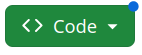
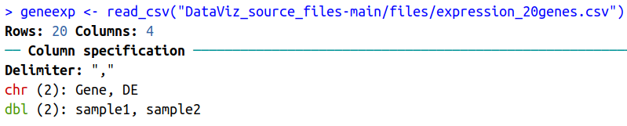
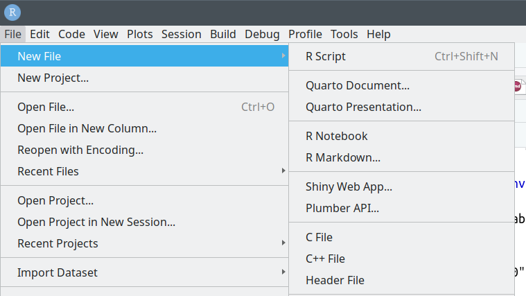

# Import data / read files / scripts

We will learn how to **import the content of a file** in R using the **{readr}** package (part of the **{tidyverse}** we previously installed).

## Fetch workshop files

First, let's copy locally a few files that were prepared for this workshop.

* Go to: https://github.com/sarahbonnin/DataViz_source_files

* Download the ZIP archive, as follows:

Click on  -> Download ZIP:


* Save the archive in the course folder (**DataViz_R_2024**)

* Extract the archive (click right on the archive and you should see some extraction options).

What is extracted from the archive is the **DataViz_source_files-main** folder, which in turns contains a **files** folder: this contains the files we need for the course.

The **path** to fetch the files is the following (remember that the first piece is *OS/user* dependent):

*/your_home_directory/*DataViz_R_2024/**DataViz_source_files-main/files**

e.g.

/users/sbonnin/DataViz_R_2024/**DataViz_source_files-main/files**

## Import / read in data

### from CSV

Let's now import the content of a first file in our environment.

There are several ways we can specify the path / location of a file:

* Using the "absolute path":

```{r, echo=T, eval=F, message=F, warning=F}
# absolute path
geneexp <- read_csv("/users/sbonnin/DataViz_R_2024/DataViz_source_files-main/files/expression_20genes.csv")
```

* Using the "relative path" (i.e. relative to where the session is currently located), e.g.:

```{r, echo=T, eval=T, message=F, warning=F}
# relative path (this assumes you are in the course folder)
geneexp <- read_csv("DataViz_source_files-main/files/expression_20genes.csv")
```

Because your **working directory** is */your_home_directory/*DataViz_R_2024/, R can find the **DataViz_source_files-main** without requiring that you specify the whole path (**relative vs absolute path**).

The content of file **expression_20genes.csv** is now stored in the object named **geneexp**.

The function also outputs some information about the data you are importing:



Such as that:

* The data contains 20 rows (observations), and 4 columns (variables).
* Out of these 4 columns:
  * 2 contain characters (<span style="color: red;">chr</span>): **Gene** and **DE**.
  * 2 contain numbers (<span style="color: green;">dbl</span> for "double"): **sample1** and **sample2**

Notes:

* You can find the objects that you create in the **Environment** tab in the upper-right panel.
* If you click on an object name in the **Environment** tab, it will open on the upper-left panel. Let's try with **geneexp**:


## from Excel

{tidyverse} provides the {readxl} package with functions to read in Excel files.

Although working with text files (.txt, .csv, .tsv etc.) is a better practice, you can import Excel files using the **read_excel()** function.

First, load the {readxl} package (bottom-right panel -> Packages -> search and tick readxl, or from the console, as shown below).

```{r}
library(readxl)
# Relative path:
read_excel("DataViz_source_files-main/files/expression_20genes.xlsx")
```

If the Excel file contains multiple sheets, you can specify the name of the sheet using the **sheet=** parameter:

```{r}
read_excel("DataViz_source_files-main/files/expression_20genes.xlsx",
           sheet="tab1")
```

## Scripts

A **script** is a text file containing a set of **commands** and **comments**.

It can be saved, re-used later or be shared.

It is good practice to create a script and save all commands: let's create a script for this course.

Go to File -> New File -> R script



A new window will open in the upper-left panel. Now save the file in the course folder (you can name it *workshop.R*)

**Save all commands you will use during the course, and save changes regularly!**

**TIP**: you can send a line or selected lines from the script to the console without copy-pasting: press CTRL+ENTER when highlighting the row.


