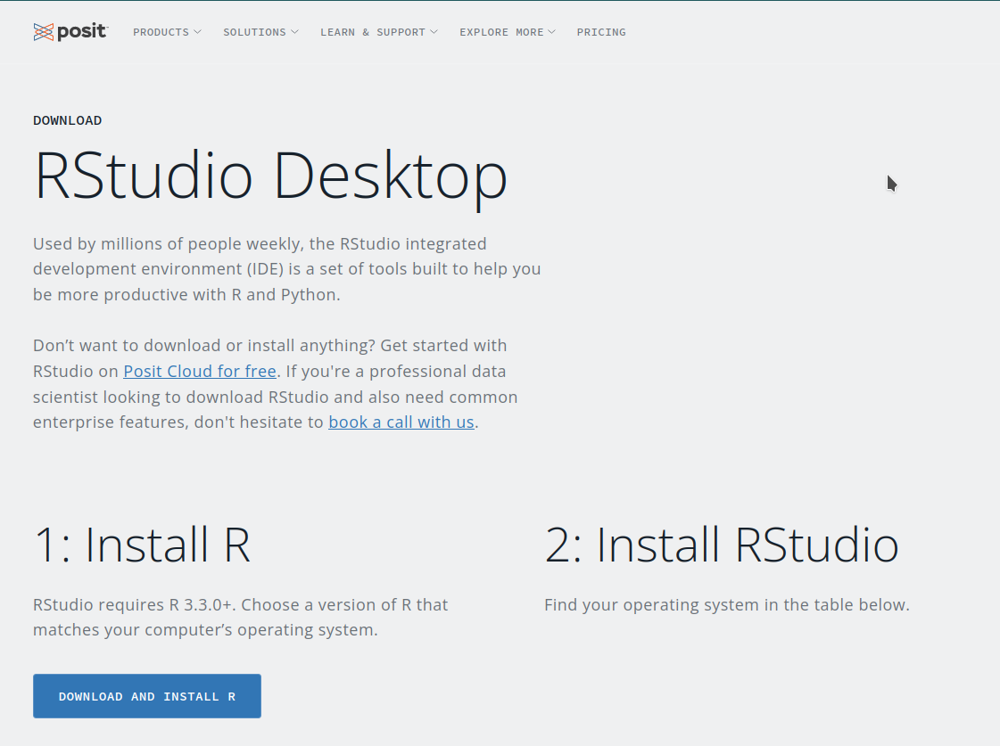
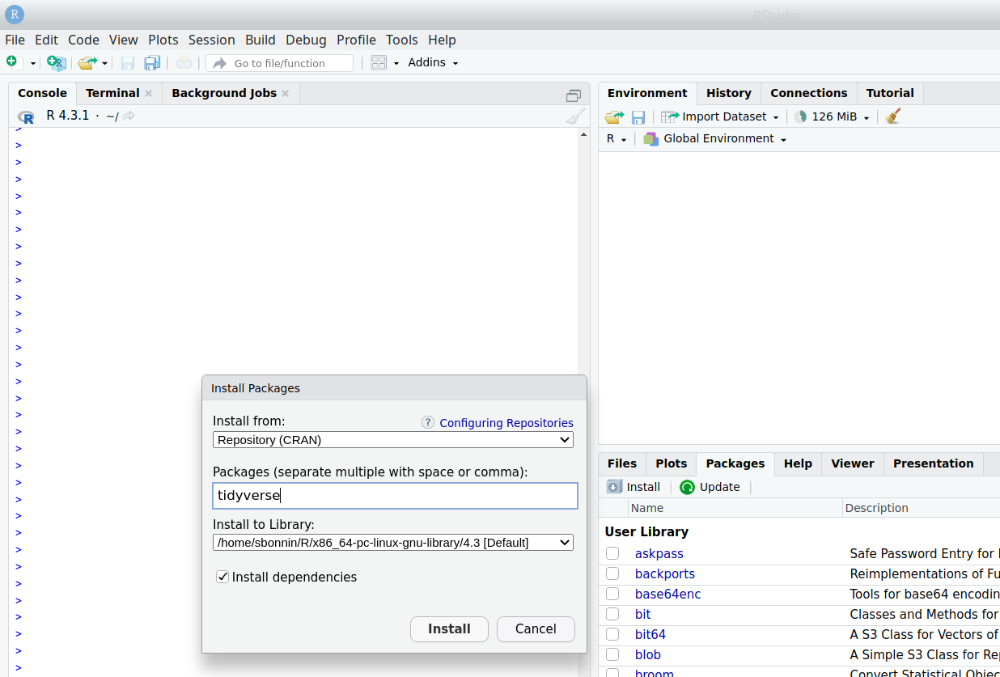
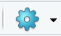
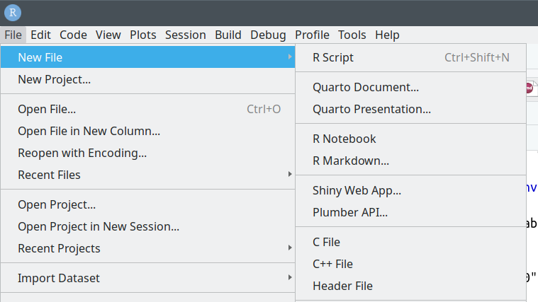
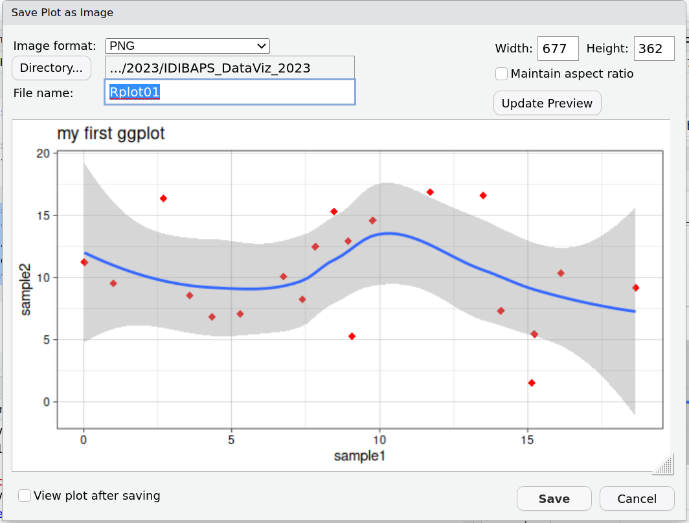
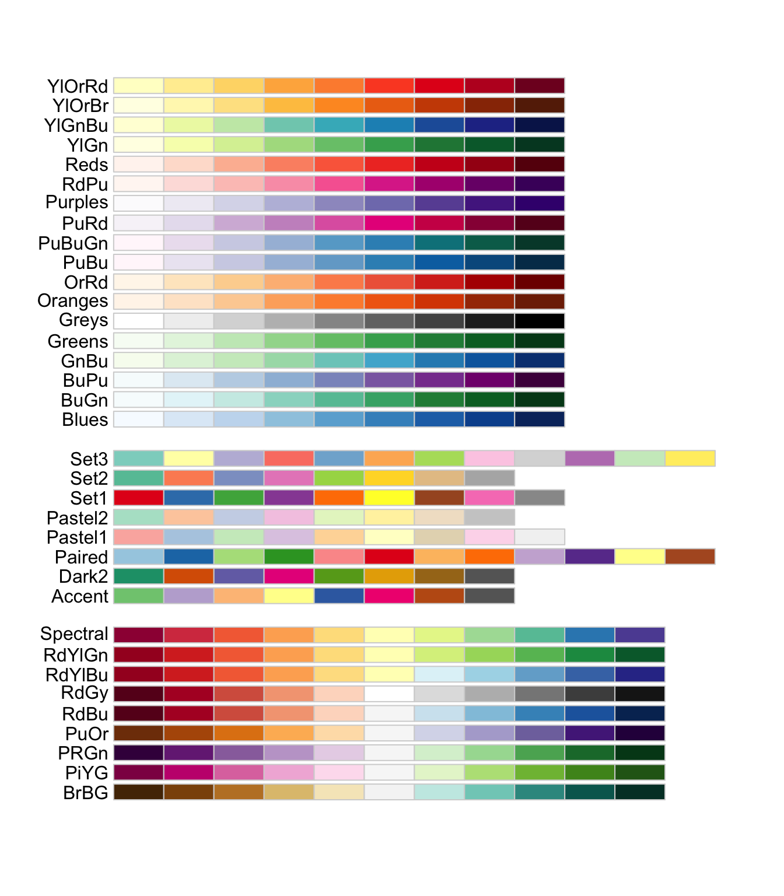

--- 
title: "R for beginners: Introduction to data visualization with R and ggplot2: from data to publication-quality figures"
author: "Sarah Bonnin"
date: "`r Sys.Date()`"
site: bookdown::bookdown_site
output: bookdown::gitbook
documentclass: book
bibliography: [book.bib, packages.bib]
biblio-style: apalike
link-citations: yes
---

# Welcome

<h3> Dates, time & location </h3>

* Dates:
  * First edition: April 9 & 11, 2024
  * Second edition: November 5 & 7, 2024

* Time:
	* 9:30-13:00 <br>

* Location:
	* IDIBAPS

<h3> Instructor </h3>
 
[Sarah Bonnin](mailto:bonninsarah@gmail.com) 

Senior bioinformatics consultant at [Clarivate](https://clarivate.com/).

<h3>Prerequisites</h3>

The workshop is open to anyone with **no (or little) prior programming experience**.

Attendees must however **feel comfortable enough with their own computer to install programs** (and debug their installation, when needed) and **locate folders and files**.

<h3> Learning objectives</h3>

Attendees will:

* Gain a high-level understanding of data import, manipulation and graphing with R and RStudio. 
* Be able to produce and save a variety of publication-quality graphs (among others: boxplots, scatter plots, barplots).

<h3>Learning outcomes</h3>

* Identify and use RStudio panels (console, scripts, folders and files panels).
* Locate useful resources to learn more and know where to seek help.
* Import data from files into R.
* Manipulate and prepare (filter, select) data.
* Produce graphs:
  * Create a plot from “recipes”.
  * Change basic parameters (color, font size, point shape, title, etc.).
  * Export high-quality graphs in different formats (pdf, jpeg, png).

<h4>What this workshop is **NOT**:</h4>

* A programming class.
* A design class.

<h4>What this workshop is:</h4>

* An introduction to R and to RStudio software.
* An introduction to data visualization.
* A teaser to - hopefully - make you want to learn how to program in R!

<h3>Approximate agenda</h3>

Day 1 & 2: 9:30-13:00.
<br>
~15-20' break around 11:15-11:30.

* Welcome and set up
* Introduction to R and RStudio (Posit)
* Paths and directories
* R basics
* Data import
* ggplot2:
  * Introduction, concept
  * Scatter plots
  * Barplots
  * Boxplots
  * Fine-tuning font
  * Colors
  * Faceting
* Data filtering and wrangling:
  * select, filter, rename
  * the pipe operator
  * from wide to long format
* More ggplots
* Exercises
* Interactive plots with {plotly}
* Heatmaps with {pheatmap}
* Demo volcano plots

  

<!--chapter:end:index.Rmd-->

# Setup

## Install R and RStudio/Posit

Follow the instructions and relevant links on the [Posit/RStudio website](https://posit.co/download/rstudio-desktop/) to install both R and RStudio Desktop:



Installation instructions depend on the operating system installed on your computer.

The next table provides a summary of links to follow, depending on the operating system:

| Opereating system | R | RStudio desktop |
|:---:|:---:|:---:|
| Windows | https://cran.rstudio.com/bin/windows/ | [Windows 10/11](https://download1.rstudio.org/electron/windows/RStudio-2023.06.2-561.exe) |
| macOS | https://cran.rstudio.com/bin/macosx/ | [macOS 11+](https://download1.rstudio.org/electron/macos/RStudio-2023.06.2-561.dmg) |
| Linux (Debian) | https://cran.rstudio.com/bin/linux/debian | [Ubuntu 20 / Debian 11](https://download1.rstudio.org/electron/focal/amd64/rstudio-2023.06.2-561-amd64.deb) |
| Linux (Ubuntu) | https://cran.rstudio.com/bin/linux/ubuntu | [Ubuntu 20 / Debian 11](https://download1.rstudio.org/electron/focal/amd64/rstudio-2023.06.2-561-amd64.deb), [Ubuntu 22](https://download1.rstudio.org/electron/jammy/amd64/rstudio-2023.06.2-561-amd64.deb) |
| Linux (Fedora / Redhat) | https://cran.rstudio.com/bin/linux/fedora | [Fedora 19 / Red Hat 7](https://download1.rstudio.org/electron/centos7/x86_64/rstudio-2023.06.2-561-x86_64.rpm), [Fedora 34 / Red Hat 8](https://download1.rstudio.org/electron/rhel8/x86_64/rstudio-2023.06.2-561-x86_64.rpm), [Fedora 36 / Red Hat 9](https://download1.rstudio.org/electron/rhel9/x86_64/rstudio-2023.06.2-561-x86_64.rpm) |

If you are using a Linux OS, you will need to install additional packages:

**Debian, Ubuntu (DEB packages):**
<br>
libcurl4-openssl-dev libssl-dev libxml2-dev libfontconfig1-dev libharfbuzz-dev libfribidi-dev libfreetype6-dev libpng-dev libtiff5-dev libjpeg-dev

**Fedora, CentOS, RHEL (RPM packages):**
<br>
libxml2-devel libcurl-devel fontconfig-devel openssl-devel  libjpeg-devel  libtiff-devel  libpng-devel

Guides for Linux package installation (you may need to contact your IT department for permissions):

* [Install a DEB package](https://help.ubuntu.com/kubuntu/desktopguide/C/manual-install.html)
* [Install an RPM package](https://access.redhat.com/solutions/1189)

## Install R packages

Once R and RStudio are successfully installed, Open RStudio:


In the bottom-right panel, click on tab “Packages” and then “Install” . 
In the “Packages” box, write “tidyverse” and click “Install”. It should look like the below image:


 


The installation of this first package will take several minutes.

Repeat the process for the following packages:

* ggrepel
* pheatmap
* plotly
* openxlsx

Note: install packages one by one, as it eases debugging in case of installation failure.

If installation of the first package (tidyverse) repeatedly fails, try and install the following packages independently:

* tidyr
* dplyr
* ggplot2
* stringr

## Check setup

In order to make sure that the setup is successful, click again on tab "Packages" of the bottom-right panel, and **tick packages that you just installed**, like the "tidyverse" package in that example:

 

If no error (in red) appear in the console (bottom-left panel), installation should be ok.

**CHECK**

Copy-paste the following line of code in the console (bottom-left panel) and click on Enter / Return. You should be able to see the scatter plot appear on the "Plots" tab in the bottom-right panel !

```{r, eval=T, echo=F, include=F}
library(tidyverse)
```

```{r, eval=T, echo=T, cache=TRUE}
diamonds %>% 
  dplyr::select(carat, price, clarity) %>%  
  ggplot(aes(x=carat, y=price, col=clarity)) + geom_point()
```


<!--chapter:end:setup.Rmd-->

# R


## What is R ?

* Programming language and environment for **data manipulation**, **statistical computing**, and **graphical display**.

* Implementation of the S programming language

* Created at the University of Auckland, New Zealand:
	+ Initial version released in 1995
	+ Stable version released in 2000
* **Free and open source !**
	+ https://www.r-project.org/

* Interactive, flexible

* Very active community of developers and users!
	+ Many resources and forums available

## Functions & packages

### Functions

A function in R is a piece of code that takes an **input** (user data, **parameters**), processes some **calculation**, and **outputs** data.

For example: the **mean()** function would take a vector / series of numbers as an input, calculate and output their average.

Functions can take **arguments/parameters**. In the example above, the main argument to mean() would be a series of numbers given by the user.

In R code, you can recognize functions because of the parenthesis ("round brackets") following their name.


### Packages

#### What are packages?

A package in R stores, in standardized format, a set of functions, data and documentation.

They are developed and shared by the community, and vary in size and complexity.

Packages are stored in a **library**.


[source](https://www.mitchelloharawild.com/blog/2018-07-10-hexwall_files/figure-html/final-1.png)

Packages are usually found in public **repositories** such as:

- CRAN (general repository for any type of data analysis).
- Bioconductor (initially specialized in high throughput data analysis / bioinformatics)

Anyone can create a package and stored it locally; creating packages is a great way to **share code**.


The previous function, **mean()**, is part of the **{base}** package that is available by default.

#### The "tidyverse"

*The [tidyverse](https://www.tidyverse.org/) is an opinionated collection of R packages designed for data science. All packages share an underlying design philosophy, grammar, and data structures.*


[source](hhttps://ajsmit.github.io/Intro_R_Official/tidy.html)

**Why do we use the tidyverse packages in this course?**

* Easier to understand / more intuitive vocabulary: better for beginners.
* More "modern" style of coding.
* Uniform in style and logic across data manipulation and visualization.

In this course, we will use in particular, and in that order:

* [{readr}](https://readr.tidyverse.org/) for importing / exporting files.
* [{ggplot2}](https://ggplot2.tidyverse.org/) for data visualization.
* [{dplyr}](https://dplyr.tidyverse.org/) for (simple) data manipulation and selection.

<!--chapter:end:Rintro.Rmd-->

# What is RStudio (Posit)?

* Free and open source IDE (Integrated Development Environment) for R

* Available for Windows, Mac OS and LINUX


## RStudio interface

* 4 panels:
	+ **top-left**: scripts and files
	+ **bottom-left**: R console Linux-line terminal / command-line
	+ **top-right**: environment, history, connections, tutorial
	+ **bottom-right**: tree of folders and files, plots/graphs window, packages, help window, viewer, presentation


## The R console

The R **console** (bottom-left panel) is where the magic happens!

It is where the user/programmer/you will **interact** with R.

Let's give it a try. Type (or copy-paste) the following in the console (bottom-left panel), and hit the **Enter/Return** key:


```{r, eval=F}
getwd()
```

**getwd()** is a function. Remember that functions are followed by **parenthesis/round brackets**.

Upon clicking **Enter/Return**, you are asking the R kernel to **execute the function**.

What R returns is the **response/result** after executing the function.

The getwd() function retrieves and outputs your current working directory.

Let's try to interact a bit more with the console: copy-paste the following, and hit Enter/Return:

```{r, eval=F}
7*3
```

R gives you the results of this simple multiplication.

**USEFUL TIP**

In the console, press the **up arrow** key : this goes **back to the previous commands/lines** you wrote and sent in the console.


<!--chapter:end:rstudio.Rmd-->

# Paths and directories

## Path and home directory

* The path of a file/directory is its **location/address** in the file system.

* Your home directory is the one that hosts the **user (your) data**: it is similar, although not identical, in all operating systems, for example:
  - */users/sbonnin* or */home/sbonnin* (Linux)
  - */Users/sbonnin* or */Home/sbonnin* (macOS)
  - *C:\\Users\\sbonnin* or *C:\\Home\\sbonnin* (Windows)
  
The starting "/" or "\\" is called the **root** directory. Directories branch downwards from the root directory, and can contain both files and subdirectories.

In the examples above, **sbonnin** is a subdirectory of **users** (or Users), and users starts at the root.

Example of a *tree* / organization of directories:


## Create the workshop directory

We will now create a folder/directory, where we will store what we produce during this course.

Go to the **Files** tab in the bottom-right corner: by default, this will be set to your **Home**.

You can navigate through the *tree* of files and directories by double clicking one folder name, to enter it, and by clicking on the **double dot ".."** to go back.

Choose the folder under which you would like to save the workshop's work.

For example, you can create it right under **Home -> Documents** (or anywhere else that you will remember, as we do not have the same folder structures). 

Click on "Home" and then on "Documents":


Create a folder called **"DataViz_R_2024"** by clicking on the **"+Folder"** icon.


You should now see a new folder:


Click on the newly created "DataViz_R_2024" folder, still under the "Files" tab, so you enter it. 

Click on the **"More file commands button"**: 



Click on **"Set As Working Directory"**:


The [working directory](https://en.wikipedia.org/wiki/Working_directory) is where R will, by default, find files to read, and that is where it will also save files and figures, if another location/path is not specified.


<!--chapter:end:pathdirectories.Rmd-->

# R basics

In this section, we will cover very basic notions of R programming.

## Arithmetic operators

R is a programming language with a statistics focus. While it can be used for very complex tasks, it can also be used as a simple **calculator**, as shown previously.

The following arithmetic operators can be used for these tasks:

| Operator  | Function      |
|:--------: |:-------------:|
|     +     | addition      |
|     -     | subtraction   |
|     /     | division      |
|     *     | multiplication|
|  ^ or **  | exponential   |

In the R terminal, as you have seen before, you can type the following:

```{r, eval=FALSE}
10-2
```

And hit **Enter** for R to interpret the command, and give you the output.

Then try the following:

```{r, eval=F}
3*5
```

or:

```{r, eval=F}
(4*12)/5
```


## Objects in R

So far, we  used the R console interactively, and received the answers from R **in the console.**

Data/output of commands can also be stored in **objects**.

Everything that stores any kind of data in R is an **object**:


When data is stored in objects, it can easily be **reused.**

## Assigning data to an object

We will use an assignment operator to **assign (i.e. store) data to an object:**

You can use either **<-** or **=** (essentially the same).

Examples:

* Assigning/storing **10** to the object named **B**:

Copy-paste the following in the console, and hit Enter.

```{r}
B <- 10
```

This time, not there is **no output**. If you now type **B** in the R console, and hit Enter, what happens?

* Reassigning: modifying the content of an object:

```{r, eval=FALSE}
B <- 12
```

* You can also use an object to assign data to a new (or to the same) object: try the following in the console:

```{r, eval=FALSE}
B <- 12
A <- 5
A <- A + B
```

What values do A and B store now?


* You can see the objects you created in the upper-right panel in RStudio that is, the **environment**:


**How to name an object?**

Naming an object in R is quite flexible.

You can use:

* letters (note that object names case sensitive: **A** and **a** are NOT the same)
* numbers (although the object name **cannot start with a number**)
* underscores **\_**

What you CANNOT use:

* Spaces
* Most special characters

## Data types

There are several data types in R: numbers, characters, booleans, factors, etc.

For this introduction, we will mainly see and use numbers and characters.

A character or string of characters must be assigned with simple or double **quotes ("")**, for example:

```{r}
myobject <- "training"
```

You should now see in the environment (upper-right corner) the new object called **training**.

Now try to assign the same object **without the quotes**:

```{r, eval=F}
myobject <- training
```

What happens?


<!--chapter:end:Rbasics.Rmd-->

# Import data / read files / scripts

We will learn how to **import the content of a file** in R using the **{readr}** package (part of the **{tidyverse}** we previously installed).

## Fetch workshop files

First, let's copy locally a few files that were prepared for this workshop.

Go to:
https://github.com/sarahbonnin/DataViz_source_files


And download the ZIP archive, as follows:

Click on  -> Download ZIP:


Save the archive in the course folder previously created (**DataViz_R_2024**) and extract it (click right on the archive and you should see some extraction options).

What is extracted from the archive is the **DataViz_source_files-main** folder, which in turns contains a **files** folder: this contains the files we need for the course.

The **path** to fetch the files is the following (remember that the first piece is OS/user dependent):

*/your_home_directory/*DataViz_R_2024/**DataViz_source_files-main/files**

e.g.

/users/sbonnin/DataViz_R_2024/**DataViz_source_files-main/files**

## Import / read in data

### from CSV

Let's now import the content of a first file in our environment:

```{r, echo=T, eval=T, message=F, warning=F}
geneexp <- read_csv("DataViz_source_files-main/files/expression_20genes.csv")
```

Because your **working directory** is */your_home_directory/*DataViz_R_2024/, R can find the **DataViz_source_files-main** without requiring the whole path: this is a **relative path** as opposed to an **absolute path** .

The content of file **expression_20genes.csv** is now stored in the object named **geneexp**.

The function also outputs some information about the data you are importing:


Such as that:

* The data contains 20 rows (observations), and 4 columns (variables).
* Out of these 4 columns:
  * 2 contain characters (<span style="color: red;">chr</span>): **Gene** and **DE**.
  * 2 contain numbers (<span style="color: green;">dbl</span> for "double"): **sample1** and **sample2**

Remember that you can find the objects that you create in the **Environment** tab in the upper-right panel.

Note that if you click on an object name in the **Environment** tab, it will open on the upper-left panel. Let's try with **geneexp**:


## from Excel

{tidyverse} provides the {readxl} package with functions to read in Excel files.

Although working with text files (.txt, .csv, .tsv etc.) is a better practice, you can import Excel files using the **read_excel()** function.

First, load the {readxl} package (bottom-right panel -> Packages -> search and tick readxl, or from the console, as shown below).

```{r}
library(readxl)
read_excel("DataViz_source_files-main/files/expression_20genes.xlsx")
```

If the Excel file contains multiple sheets, you can specify the name of the sheet using the **sheet=** parameter:

```{r}
read_excel("DataViz_source_files-main/files/expression_20genes.xlsx",
           sheet="tab1")
```

## Scripts

A **script** is a text file containing a set of **commands** and **comments**.

It can be saved and re-used later or be shared.

It is good practice to create a script and save all commands: let's create a script for this course.

Go to File -> New File -> R script



A new window will open in the upper-left panel. Now save the file in the course folder (you can name it workshop.R)

**Save all commands you will use during the course, and save changes regularly!**

**TIP**: you can send a line or selected lines from the script to the console without copy-pasting: press CTRL+ENTER when highlighting the row.


<!--chapter:end:dataimport.Rmd-->

# ggplot2

```{r global_options, include=FALSE}
knitr::opts_chunk$set(fig.width=5, fig.height=4,
                      echo=TRUE, warning=FALSE, message=FALSE)
```

* Graphing package inspired by the **G**rammar of **G**raphics work of Leland Wilkinson.

* Allows to compose graphs by combining independent **components / blocks / layers**.

* Flexible, highly customizable.

* Well documented.


*image from https://www.cedricscherer.com/img/ggplot-tutorial/overview.png*


## Getting started

A ggplot graph needs at least 3 components:

* **Data**: that is the source data that we want to represent.
* **Aesthetics** mappings: they describe what will be visualized from **data**.
* **Geometrics**: functions that represent what we see in the graph: lines, points, boxes etc. for example:
  * geom_point()
  * geom_lines()
  * geom_histogram()
  * geom_boxplot()
  * geom_bar()
  * geom_smooth()
  * geom_tiles()

The base structure is the following:

**ggplot(\<DATA\>, \<AESTHETICS\>) + \<GEOMETRICS\>**


For example if we want to represent **column1** (on the x axis) and **column2** (on the y axis) of **data** as **points**, we would use the following structure:

```{r, eval=F, echo=TRUE}
ggplot(data=dataframe, mapping=aes(x=column1, y=column2)) + geom_point()
```

This will be our template as we explore different types of graphs.

We can add **more layers** to this base structure to customize the plot further, as we will see in the next examples.

## Scatter plot

### Base plot

We can start from the **geneexp** object, that holds the content of file *expression_20genes.csv*: we want to plot **sample1** on the x axis and **sample2** on the y axis.

The base layer will be the following:

```{r, eval=T}
ggplot(data=geneexp, mapping=aes(x=sample1, y=sample2))
```

Try to copy-paste it in the console, and hit Enter. As you can see, nothing is actually plotted yet, but the base is set.

Adding to this the geometrics called **geom_point()**, we **tell ggplot to produce a scatter/point plot**:

```{r, eval=T}
# This line is a comment: a comment is not interpreted by R.
# Example of a scatter plot: add the geom_point() layer
ggplot(data=geneexp, mapping=aes(x=sample1, y=sample2)) + 
  geom_point()

# Note that the new line is not necessary after the "+": it is done for readibility.
```

Please, copy the code above in your script!

Your plot should appear in the "Plots" tab in the bottom-right panel.

### Customize the points

**geom_point()** also takes some parameters, including the point color and size:

Color all points in red:

```{r}
ggplot(data=geneexp, mapping=aes(x=sample1, y=sample2)) + 
  geom_point(color="red")
```

Make points larger (size default is 1.5):

```{r}
ggplot(data=geneexp, mapping=aes(x=sample1, y=sample2)) + 
  geom_point(color="red", size=2.5)
```

This is a good place to introduce the **help pages** of functions!

Functions in **ggplot2** (and **tidyverse** in general) are richly documented.

While documentation can be quite technical it is always good practice to take a look at it.

You can access the help page of a function in the **Help** tab in the bottom-right panel. Give it a try with "geom_point":


Back to our customization: you can set different shapes for the points!

This is done by setting the **shape** parameter in **geom_point()**.

For example, triangles:

```{r}
ggplot(data=geneexp, mapping=aes(x=sample1, y=sample2)) + 
  geom_point(color="red", size=2.5, shape="triangle")
```

See more options in the following image:


*Image from ggplot2 documentation*

### Add more layers

We can add more layers to the plot, using the same structure (**+ layer_name()**)

#### ggtitle()

Add a title using the **ggtitle()** layer:

```{r}
ggplot(data=geneexp, mapping=aes(x=sample1, y=sample2)) + 
  geom_point(color="red", size=2.5, shape="diamond") +
  ggtitle(label="my first ggplot")
```

**label** is a parameter of **ggtitle()** function.

#### Background

Not a big fan of the grey background?
This is the default "theme", but there are [more options](https://ggplot2.tidyverse.org/reference/ggtheme.html).

For example:

```{r}
ggplot(data=geneexp, mapping=aes(x=sample1, y=sample2)) + 
  geom_point(color="red", size=2.5, shape="diamond") +
  ggtitle(label="my first ggplot") +
  theme_linedraw()
```

```{r}
ggplot(data=geneexp, mapping=aes(x=sample1, y=sample2)) + 
  geom_point(color="red", size=2.5, shape="diamond") +
  ggtitle(label="my first ggplot") +
  theme_bw()
```

```{r}
ggplot(data=geneexp, mapping=aes(x=sample1, y=sample2)) + 
  geom_point(color="red", size=2.5, shape="diamond") +
  ggtitle(label="my first ggplot") +
  theme_grey()
```

A good page to check the different backgrounds:
https://ggplot2-book.org/themes#sec-theme


#### Regression line

Add a regression line with **geom_smooth()**. A smoothed line can help highlight the dominant pattern/trend.

```{r}
ggplot(data=geneexp, mapping=aes(x=sample1, y=sample2)) + 
  geom_point(color="red", size=2.5, shape="diamond") +
  ggtitle(label="my first ggplot") +
  theme_linedraw() +
  geom_smooth()
```

## Save your plot

### From the interface

Before we dive into more graph types, we we learn how to easily save the current plot.

In the "Plots" tab, click on "Export" and "Save as image":


From that windows, you can:

* Pick an image format between: PNG, JPEG, TIFF, BMP, SVG, EPS.
* Choose where you want to **save the output file** (by default, R will propose the current working directory).
* Choose the **file name**.
* Set the dimensions, by either:
  * Setting the Width and Height of the figure (in pixels)
  * Moving the graph manually (bottom-right corner of the plot) until you obtain the size and proportions that you want.



### From the console

The best way to save a plot to a few from the console, is using the ggsave function.

First, you need to save the plot to an object (if you don't, ggplot will create a file from the latest plot, which is fine too!).

```{r}
myplot <- ggplot(data=geneexp, mapping=aes(x=sample1, y=sample2)) + 
  geom_point(color="red", size=2.5, shape="diamond") +
  ggtitle(label="my first ggplot")
```

Many different formats are available:

* eps
* ps
* tex
* pdf
* jpeg
* tiff
* png
* bmp
* svg
* wmf

```{r}
ggsave(filename="myplot.png", plot=myplot, device="png")
```

You can specify the plot size units between inches "in", centimeters "cm", milimeters "mm" or pixels "px".

You can also specify the **dpi**, i.e. dots per inches.

If we take as an example the requirements of electronic image formats [for Nature publishing group](https://www.nature.com/nature/for-authors/final-submission):

"Layered Photoshop (PSD) or TIFF format (high resolution, 300–600 dots per inch (dpi) )"

We could save the plot the following way:

```{r}
ggsave(filename="myplot.tiff", plot=myplot, 
       device="tiff", dpi=300, 
       units="in", width=5, height=5)
```


## Exercise 1

Time for our first exercise! 

Starting from the same object **geneexp**:

1. Create a scatter plot that shows sample2 on the x-axis and sample1 on the y-axis.

<details>
<summary>
correction
</summary>

```{r}
ggplot(data=geneexp, mapping=aes(x=sample2, y=sample1)) + 
  geom_point()
```

</details>

<br>
2. Change the point color to blue, and the point size to 2.

<details>
<summary>
correction
</summary>

```{r}
ggplot(data=geneexp, mapping=aes(x=sample1, y=sample2)) + 
  geom_point(color="blue", size=2)
```

</details>

<br>
3. Change the point shape to "square cross"

<details>
<summary>
correction
</summary>

```{r}
ggplot(data=geneexp, mapping=aes(x=sample1, y=sample2)) + 
  geom_point(color="blue", size=2, shape="square cross")
```

</details>

<br>
4. Add the title of your choice.

<details>
<summary>
correction
</summary>

```{r}
ggplot(data=geneexp, mapping=aes(x=sample1, y=sample2)) + 
  geom_point(color="blue", size=2, shape="square cross") +
  ggtitle(label="my second ggplot")
```

</details>

<br>
5. Add a subtitle (wait: that's new! Google check **ggtitle** help page and/or "ggtitle subtitle" and see if you can find out!)

<details>
<summary>
correction
</summary>

```{r}
ggplot(data=geneexp, mapping=aes(x=sample1, y=sample2)) + 
  geom_point(color="blue", size=2, shape="square cross") +
  ggtitle(label="my second ggplot", subtitle="nice blue squares")
```

</details>

<br>
6. Save your plot as a JPEG file, in the course folder, with dimensions 600X600 pixels.

<details>
<summary>
correction
</summary>

From the interface:

Bottom-right panel -> Plots tab -> Export -> ...

From the console:

```{r}
# first, save in an object
mybluescatterplot <- ggplot(data=geneexp, mapping=aes(x=sample1, y=sample2)) + 
  geom_point(color="blue", size=2, shape="square cross") +
  ggtitle(label="my second ggplot", subtitle="nice blue squares")

# then save with ggsave
ggsave(filename="myblueplot.jpg", plot=mybluescatterplot, 
       device="jpeg", 
       units="px", width=600, height=600)
```
</details>

## Scatter plots: more features

Let's customize our scatter plot a bit more.

We may want to show the gene names that the points represent.

This is done by:

* setting the **label** parameter, in the ggplot **aes()** function
* adding the **geom_text()** layer

```{r}
ggplot(data=geneexp, mapping=aes(x=sample1, y=sample2, label=Gene)) + 
  geom_point() +
  geom_text()
```

Not bad, but let's adjust the location of the labels, so they do not overlap with the points.

We can set the **nudge_x** parameter, to move the labels horizontally (on the **x** axis).

```{r}
ggplot(data=geneexp, mapping=aes(x=sample1, y=sample2, label=Gene)) + 
  geom_point() +
  geom_text(nudge_x=1.5)
```

We can also decrease or increase the label size:

```{r}
ggplot(data=geneexp, mapping=aes(x=sample1, y=sample2, label=Gene)) + 
  geom_point() +
  geom_text(nudge_x=1.5, size=3)
```

Note that the automatic organization of labels, so that they do not overlap, can be done using the {ggrepel} package. You only need to load the package and change **geom_text()** to **geom_repel_text()**:

```{r, eval=T, echo=F}
library(ggrepel)
```

```{r}
ggplot(data=geneexp, mapping=aes(x=sample1, y=sample2, label=Gene)) + 
  geom_point() +
  geom_text_repel()
```


Last but not least: point color and shape can be **dependent on another column / variable of the data**. 

Columns to **conditionally color or shape the points** should be specified inside the **aes()** function.

For **shape**:

```{r, fig.width=7}
ggplot(data=geneexp, mapping=aes(x=sample1, y=sample2, label=Gene, shape=DE)) + 
  geom_point() +
  geom_text(nudge_x=1.2, size=3)
```

For **color**:

```{r, fig.width=7}
ggplot(data=geneexp, mapping=aes(x=sample1, y=sample2, label=Gene, color=DE)) + 
  geom_point() +
  geom_text(nudge_x=1.2, size=3)
```

TIP: remove the weird double labeling in the legend (a letter behind the point): set **show.legend=FALSE** in **geom_text()**:

```{r, fig.width=7}
ggplot(data=geneexp, mapping=aes(x=sample1, y=sample2, label=Gene, color=DE)) + 
  geom_point() +
  geom_text(nudge_x=1.2, size=3, show.legend=FALSE)
```


<details>
<summary>
*More advanced (as reference, or if someone asks): how to change default colors:*
</summary>

Colors can be set manually using (yet another) layer: **scale_color_manual()**.

```{r, fig.width=7}
ggplot(data=geneexp, mapping=aes(x=sample1, y=sample2, label=Gene, color=DE)) + 
  geom_point() +
  geom_text(nudge_x=1.2, size=3) +
  scale_color_manual(values=c(Down="blue", No="black", Up="red"))
```

</details>

## Barplots

A barplot (or barchart) is a graph that represents categorical data with rectangular bars, which heights are proportional to the values they represent.

The first layer of the **ggplot()** function will be similar. However, note that we start with only the **x=** parameter set in **aes()** function (this is the basic way to plot a barplot):

```{r, eval=F}
ggplot(data=dataframe, mapping=aes(x=column1)) +
  geom_bar()
```

Using our previous **geneexp** data, we can produce a bar plot out of the **DE** column, such as:

```{r}
ggplot(geneexp, aes(x=DE)) + 
  geom_bar()
```

This produces a barplots containing 3 bars: **Down**, **No** and **Up**: their height represents the number of genes found in each category.


## Exercise 2

1. Import file **DataViz_source_files-main/files/gencode.v44.annotation.csv** in R, into an object called **gtf**.

<details>
<summary>
correction
</summary>

```{r}
gtf <- read_csv("DataViz_source_files-main/files/gencode.v44.annotation.csv")
```

This is a small subset of the gencode v44 human gene annotation:

* Only protein coding, long non-coding, miRNAs, snRNAs and snoRNAs
* Limited to chromosomes 1 to 10
* Random subset of 1000 genes
* Converted to a friendly csv format.

</details>

<br>
2. Create a simple barplot representing the count of genes per chromosome:

<details>
<summary>
correction
</summary>

```{r}
ggplot(data=gtf, mapping=aes(x=chr)) + 
  geom_bar()
```

</details>

<br>
3. Keeping the chromosome on the x axis, split the barplot **per gene type**.

TIP: remember how we set **color=** in **mapping=aes()** function in the scatter plot section? Give it a try here!

<details>
<summary>
correction
</summary>

```{r}
ggplot(data=gtf, mapping=aes(x=chr, color=gene_type)) + 
  geom_bar()
```

</details>

<br>
4. Now try with **fill** instead of **color** in **aes()**:

<details>
<summary>
correction
</summary>

```{r}
ggplot(data=gtf, mapping=aes(x=chr, fill=gene_type)) + 
  geom_bar()
```

</details>

<br>
5. Add a title to the graph:

<details>
<summary>
correction
</summary>

```{r}
ggplot(data=gtf, mapping=aes(x=chr, fill=gene_type)) + 
  geom_bar() +
  ggtitle(label = "Number of genes per chromosome, split by gene type")
```

</details>

<br>
6. Change the default [**theme**](https://ggplot2-book.org/themes):

<details>
<summary>
correction
</summary>

```{r}
ggplot(data=gtf, mapping=aes(x=chr, fill=gene_type)) + 
  geom_bar() +
  ggtitle(label = "Number of genes per chromosome, split by gene type") +
  theme_bw()
```

</details>

<br>
7. Save the graph in PNG format in the course's directory.

<details>
<summary>
correction
</summary>

```{r}
# save plot in an object
gtfbars <- ggplot(data=gtf, mapping=aes(x=chr, fill=gene_type)) + 
  geom_bar() +
  ggtitle(label = "Number of genes per chromosome, split by gene type") +
  theme_bw()

# save as PNG file
ggsave(filename="gtfbarplot.png", plot=gtfbars, 
       device="png")
```


## Barplots: bars position

We can also play with the **position** of the bars. By default, position is **stack**, i.e. categories are stacked on top of each other along the bar.

Position **fill** will show the proportions, instead of the absolute values, of each category:

```{r}
ggplot(data=gtf, mapping=aes(x=chr, fill=gene_type)) + 
  geom_bar(position="fill")
```

Position **dodge** is representing each category (here, continents), next to each other:

```{r}
ggplot(data=gtf, mapping=aes(x=chr, fill=gene_type)) + 
  geom_bar(position="dodge")
```

<details>
<summary>
*More advanced (as reference, or if someone asks): how to reorder x-axis labels:*
</summary>

Factors are a data type in R: they are used to represent categorical data. Using factors requires a bit more understanding of R works/thinks, but here is an application:

```{r}
ggplot(data=gtf, mapping=aes(x=factor(chr, levels=c("chr1", "chr2", "chr3", "chr4", "chr5", "chr6", "chr7", "chr8", "chr9", "chr10"), ordered=TRUE), fill=gene_type)) + 
  geom_bar(position="dodge") +
  xlab("chromosome")
```

</details>

### stats="identity" parameter

geom_bar() can work a bit differently, when facing numbers instead of categories.

geom_bar()'s default behavior is to **count the number of occurrences of each value found in x**: it does not expect a y-value. the default is stat="count".

If you set stat parameter to "identity", ggplot2 skips the aggregation and values used for the bars are provided by the user in **x**.


Let's import data from file: **DataViz_source_files-main/files/stats_continents_barcelona_2013-2023_long.csv** 
into an object called **statsbcn**.

The data contains the number of foreign residents in Barcelona from 2013 to 2023.

```{r}
statsbcn <- read_csv("DataViz_source_files-main/files/stats_continents_barcelona_2013-2023_long.csv")
```

How many rows and how many columns does the data contain?

In the barplots we created so far, R takes categories in the columns specified in **x=** and counts the number of occurrences.

The argument **stat="identity"** in geom_bar() is telling R to calculate the sum of the variable specified in **y=**, **grouped by the x variable**: bars of the barplot will display the sums.

In the following example, we are plotting the sum of foreign residents in Barcelona (Population provided in **y**) per year (Year provided in **x**):

```{r}
ggplot(statsbcn, aes(x=Year, y=Population)) + 
  geom_bar(stat="identity")
```


Here, we can provide **Continent** to **fill**:

```{r}
ggplot(statsbcn, aes(x=Year, y=Population, fill=Continent)) + 
  geom_bar(stat="identity")
```

We can here again play with the **position**. 

Position **fill** :

```{r}
ggplot(statsbcn, aes(x=Year, y=Population, fill=Continent)) + 
  geom_bar(stat="identity", position="fill")
```

Position **dodge** :

```{r}
ggplot(statsbcn, aes(x=Year, y=Population, fill=Continent)) + 
  geom_bar(stat="identity", position="dodge")
```

You can control the width of bars (hence, the spacing between 2 bars) using the **width** parameter of geom_bar():

```{r}
ggplot(statsbcn, aes(x=Year, y=Population, fill=Continent)) + 
  geom_bar(stat="identity", position="dodge", width = 0.8)
```


<details>
<summary>
*More advanced (as reference, or if someone asks): display all labels:*
</summary>

Convert "Year" column as character, instead of numbers:

```{r}
ggplot(statsbcn, aes(x=as.character(Year), y=Population, fill=Continent)) + 
  geom_bar(stat="identity", position="dodge")
```

</details>

## Boxplots

A boxplot is used to visualize the distribution of data.


*[Source](https://i.ytimg.com/vi/BE8CVGJuftI/maxresdefault.jpg)*

We can import data from a file that contains the same information as **geneexp** but in a slightly different format:

```{r, echo=T, eval=T, message=F, warning=F}
geneexp2 <- read_csv("DataViz_source_files-main/files/expression_20genes_long.csv")
```

In our first boxplot, one box corresponds to one sample:

```{r}
ggplot(geneexp2, aes(x=sample, y=expression)) + 
  geom_boxplot()
```

The same way we did for barplots, we can split boxes by **DE**:

```{r}
ggplot(geneexp2, aes(x=sample, y=expression, fill=DE)) + 
  geom_boxplot()
```

If you prefer a violin plot, it is easy:

```{r}
ggplot(geneexp2, aes(x=sample, y=expression, fill=DE)) + 
  geom_violin()
```

Violin plots also aim to visualize data distribution. While boxplots can only show summary statistics / quantiles, violin plots also show the density of each variable.

## Fine-tuning text

Being able to change font size (axis text, title, legend, etc.) in your graph can be very important for readability.

Changing text size in ggplot2 graphs should be done using the **theme()** package, that unfortunately utilizes a difficult structure.

We will illustrate some font size modifications on our very first scatter plot.

Change **overall** font size:

```{r}
ggplot(data=geneexp, mapping=aes(x=sample1, y=sample2)) + 
  geom_point() +
  ggtitle("scatter plot") +
  theme(text = element_text(size = 20))
```

Change font size of axis text:

```{r}
ggplot(data=geneexp, mapping=aes(x=sample1, y=sample2)) + 
  geom_point() +
  ggtitle("scatter plot") +
  theme(axis.text = element_text(size = 20))
```

Change font size of axis titles:

```{r}
ggplot(data=geneexp, mapping=aes(x=sample1, y=sample2)) + 
  geom_point() +
  ggtitle("scatter plot") +
  theme(axis.title = element_text(size = 20))
```

Remove axis titles (x-axis title given as an example):

```{r}
ggplot(data=geneexp, mapping=aes(x=sample1, y=sample2)) + 
  geom_point() +
  ggtitle("scatter plot") +
  theme(axis.title.x = element_blank())
```

Shift a bit the main title (it is by default centered to the left):

```{r}
ggplot(data=geneexp, mapping=aes(x=sample1, y=sample2)) + 
  geom_point() +
  ggtitle("scatter plot") +
  theme(plot.title = element_text(hjust = 0.5))
```

Change font size of the main title:

```{r}
ggplot(data=geneexp, mapping=aes(x=sample1, y=sample2)) + 
  geom_point() +
  ggtitle("scatter plot") +
  theme(plot.title = element_text(size = 20, hjust = 0.5))
```

Change the color of the title, and make it bold:

```{r}
ggplot(data=geneexp, mapping=aes(x=sample1, y=sample2)) + 
  geom_point() +
  ggtitle("scatter plot") +
  theme(plot.title = element_text(size = 20, hjust = 0.5, face = "bold", colour = "blue"))
```

You can also use theme() to rotate the x-axis label of plots, for example:

```{r}
ggplot(data=geneexp, mapping=aes(x=sample1, y=sample2)) + 
  geom_point() +
  ggtitle("scatter plot") +
  theme(axis.text.x = element_text(angle=90))
```

If you want to learn more, you can check this [complete guide on how to modify the ggplot2 theme](https://ggplot2tor.com/theme/).

## Colors

Colors can be set a different way in ggplot2, and in R in general.

The easiest way is to fetch the colors [by their names](https://r-graph-gallery.com/42-colors-names.html).

There are 657 color names available for you to pick! You can check them by pasting the following in the console:

```{r, eval=F}
colors()
```

ggplot2 provides a color scale by default. Mainy different **palettes** are available to change the default scale.

You can easily pick palettes from the [**RColorBrewer** package](https://r-graph-gallery.com/38-rcolorbrewers-palettes.html), that is included in ggplot2.

Available palettes are shown below:



We can easily take advantage of the RColorBrewer's palettes by using either **scale_color_brewer()** or **scale_fill_brewer()** layers (depending if **color** or **fill** was set in **aes()**, respectively):

```{r}
ggplot(data=gtf, mapping=aes(x=chr, fill=gene_type)) + 
  geom_bar(position="dodge") +
  scale_fill_brewer()
```

The default palette used is the "Blues" palette.

How does that look using "Dark2" palette?

```{r}
ggplot(data=gtf, mapping=aes(x=chr, fill=gene_type)) + 
  geom_bar(position="dodge") +
  scale_fill_brewer(palette="Dark2")
```

## Faceting

ggplot2 provides **facet** functions in R, that allow to easily **split the plot**, according to a given variable.

For example, we can start again from the **gtf** object.

You can run the following command if you do not have the data loaded in your environment:

```{r}
gtf <- read_csv("DataViz_source_files-main/files/gencode.v44.annotation.csv")
```

We produced a barplot out of this data. However, there is one variable that we did not consider: **strand**.

Using the faceting function **facet_wrap**, one can easily split that barplot into 2 plots: one will represent the **+** strand, one will represent the **-** strand.

```{r, fig.width=15}
ggplot(data=gtf, mapping=aes(x=chr, fill=gene_type)) + 
  geom_bar(position="dodge") + 
  facet_wrap(~strand)
```


If you want to organize plots vertically, you can set **dir="v"**:

```{r, fig.width=15}
ggplot(data=gtf, mapping=aes(x=chr, fill=gene_type)) + 
  geom_bar(position="dodge") + 
  facet_wrap(~strand, dir="v")
```

You can also split/facet the plots using a second variable, for example:

```{r, fig.width=15, fig.height=15}
ggplot(data=gtf, mapping=aes(x=chr, color=chr)) + 
  geom_bar(position="dodge") + 
  facet_wrap(gene_type~strand)
```

By default, scales are common in all plots. You may want to change this to "free scales" for more readability: it will set the scales per sub-plot.

```{r, fig.width=15, fig.height=15}
ggplot(data=gtf, mapping=aes(x=chr, color=chr)) + 
  geom_bar(position="dodge") + 
  facet_wrap(gene_type~strand, scales = "free")
```


<!--chapter:end:ggplot2.Rmd-->

# Data filtering and wrangling

We will now see a few functions to filter, select and re-organize a data object.

## filter()

**filter()** will filter **rows**.

If we take the **geneexp** objet as an example, we can filter only down-regulated genes using the **filter()** function of **{dplyr}**.

In case you need to import the data again:

```{r, eval=FALSE}
geneexp <- read_csv("DataViz_source_files-main/files/expression_20genes.csv")
```

```{r}
filter(geneexp, DE=="Down")
```

**==** is a **logical operator** that represens equality. It means that filter will return **rows in geneexp that are exactly equal to "Down"**.

Logical operators:

| Operator  | Description   |
|:--------: |:-------------:|
|     <     | less than    |
|     <=    | less than or equal to   |
|     >     | greater than  |
|     >=    | greater than or equal to|
|     ==    | exactly equal to   |
|     !=    | not equal to |
|    !x     | not x |
|    x \| y  | x OR y |
|    x & y  | x AND y |

We can have several conditions.

For example, we may want to extract only **Up** or **Down** rows from geneexp column **DE**:

```{r}
filter(geneexp, DE=="Down" | DE=="Up")
```

Here, we introduce another operator, **|**, which mean **OR**, so rows will be kept if there is either **Down** or **Up** in **DE** column.

A good practice is to assign the filtered output to a new object, for example:

```{r}
geneexp_filt <- filter(geneexp, DE=="Down" | DE=="Up")
```

## select()

**select()** will select **columns**.

Select only columns **Gene** and **DE** from **geneexp**:

```{r}
select(geneexp, Gene, DE)
```

Again, a good practice is to save that subset into a new object:

```{r}
geneexp_selected <- select(geneexp, Gene, DE)
```

## rename()

You can easily rename a column using the **rename()** function.

For example, we can rename column **Gene** to **Symbol**, the following way:

```{r}
rename(geneexp, Symbol=Gene)
```

The first argument is the data, then comes the column(s) to rename in the format: *new_name=old_name*.


## Exercise 3

We will start from **gtf** object.

Read it as follows, if it is not in your environment:

```{r, eval=F}
gtf <- read_csv("DataViz_source_files-main/files/gencode.v44.annotation.csv")
```

1. Rename column **chr** to **Chromosome**. Assign to a new object.

<details>
<summary>
correction
</summary>

```{r}
gtf2 <- rename(gtf, chromosome=chr)
```

</details>

<br>
2. Keep only rows corresponding to the **+** strand and to chromosome **chr4**. assign to a new object.

<details>
<summary>
correction
</summary>

```{r}
gtf3 <- filter(gtf2, strand=="+" & chromosome=="chr4")
```

</details>

<br>

3. Select only columns **gene_symbol** and **gene_type**.

<details>
<summary>
correction
</summary>

```{r}
gtf4 <- select(gtf3, gene_symbol, gene_type)
```

</details>

<br>

## The pipe operator

The **tidyverse** provides a function **%>%** which **pipes** the output of one function as the input of the next function. 

This way, different functions from the tidyverse can be linked together into a clean piece of code.

If we want to produce a one-liner out of the 3 lines of code of the previous exercise, we can do it the following way:

```{r}
gtf_final <- rename(gtf, chromosome=chr) %>%
  filter(strand=="+" & chromosome=="chr4") %>%
  select(gene_symbol, gene_type)
```

*Note that, in filter and select, you do not need to specify the first parameter (the data), as it is automatically looking for the output of the previous one!*

If you want to learn more about the **pipe**, you can for example refer to [that page](https://style.tidyverse.org/pipes.html).

Note that we can also link the data manipulation output to ggplot: the **output of the last command will then be used as an input to ggplot**:

```{r}
rename(gtf, chromosome=chr) %>%
  filter(strand=="+" & chromosome=="chr4") %>%
  select(gene_symbol, gene_type) %>% 
  ggplot(aes(x=gene_type)) + geom_bar()
```


## From wide to long format

The wide format is what you would typically have in a table with measurements, such as genes in rows and samples in columns.

However, we have seen that ggplot2 requires data to be **converted to a long format**.

In a long format, **one row corresponds to one observation/measurement, with all information associated to it**.

**{tidyr}** provides **pivot_longer()** to convert wide to long format, and **pivot_wider()** to convert a long to a wide format.

Our object geneexp is in a wide format. Two columns contain values of expression:

```{r, echo=F}
head(geneexp, 5)
```

In order to convert to a long format we will create:

* One column that contains the sample names
* One column that contains the expression values

```{r}
pivot_longer(geneexp, cols=c("sample1", "sample2"))
```

We can specify the names of the new columns as we create them:

```{r}
pivot_longer(geneexp, cols=c("sample1", "sample2"), names_to = "samples", values_to = "expression")
```

## Exercise 4

Let's do a small exercise to practice this conversion.

1. Read in file **DataViz_source_files-main/files/stats_countries_barcelona_2013-2023.csv**

<details>
<summary>
correction
</summary>

```{r}
stats_countries <- read_csv("DataViz_source_files-main/files/stats_countries_barcelona_2013-2023.csv")
```

</details>

<br>
2. Columns 2013 to 2022 contain **observations**. Convert this wide format into a long format. Save into a new object.

<details>
<summary>
correction
</summary>

```{r, eval=TRUE}
# Option 1: list all columns
stats_countries_long <- pivot_longer(stats_countries, 
                                     cols=c("2013", "2014", "2015", "2016", "2017", "2018", "2019", "2020", "2021", "2022", "2023"),
                                     values_to = "Population",
                                     names_to = "Years")

# Option 2: select columns that start with "20"
stats_countries_long <- pivot_longer(stats_countries, 
                                     cols=starts_with("20"),
                                     values_to = "Population",
                                     names_to = "Years")

# Option 3: select all numeric columns
stats_countries_long <- pivot_longer(stats_countries, 
                                     cols=where(is.numeric),
                                     values_to = "Population",
                                     names_to = "Years")
```

</details>

<br>
3. Do the 3 following tasks linked by a **%>%** (pipe):

* Keep only rows that 
  * match continent "America"
  * have a population >= 50
* Remove column **Continent**.
* Produce a barplot with "Years" in the x-axis, Population in the y-axis, and split by Country.

<details>
<summary>
correction
</summary>

```{r, fig.width=15}
filter(stats_countries_long, Continent=="America" & Population >= 50) %>%
  select(-Continent) %>%
  ggplot(mapping=aes(x=Years, y=Population, fill=Country)) + geom_bar(stat = "identity", position = "dodge")
```

</details>

<!--chapter:end:data_wrangling.Rmd-->

# More ggplots

## Histograms and density plots

### Histogram

We can use one of our previous objects to create a histogram. You can get it back with:

```{r}
rnaseq2 <- read_csv("DataViz_source_files-main/files/GSE150029_rnaseq_log2_long.csv")
```

```{r}
ggplot(rnaseq2, aes(x=log2_counts)) + 
  geom_histogram()
```

We can split the histogram per sample:

```{r}
ggplot(rnaseq2, aes(x=log2_counts, color=sample)) + 
  geom_histogram() 
```

Set position to "identity", so histograms will not be on top of each other:

```{r}
ggplot(rnaseq2, aes(x=log2_counts, color=sample)) + 
  geom_histogram(position="identity")
```

Set alpha (transparency to 0.2):

```{r}
ggplot(rnaseq2, aes(x=log2_counts, color=sample)) + 
  geom_histogram(position="identity", alpha=0.2)
```

Express as density instead of counts:

```{r}
ggplot(rnaseq2, aes(x=log2_counts, color=sample)) + 
  geom_histogram(aes(y=after_stat(density)), position="identity", alpha=0.2) +
  theme_classic()
```


### Density plot

The structure is pretty much the same:

```{r}
ggplot(rnaseq2, aes(x=log2_counts, color=sample)) + 
  geom_density(alpha=0.2) +
  theme_classic()
```

You can use fill instead:

```{r}
ggplot(rnaseq2, aes(x=log2_counts, fill=sample)) + 
  geom_density(alpha=0.2) +
  theme_classic()
```

### Histogram + density

As we combined geom_boxplot and geom_violin in a previous exercise, we can also combine geom_histogram and geom_density:

```{r}
ggplot(rnaseq2, aes(x=log2_counts, color=sample)) + 
  geom_histogram(aes(y=after_stat(density)), position="identity", alpha=0.2) +
  geom_density(alpha=0.2) +
  theme_classic()
```


## Pie chart

We will plot a pie chart representing the number of genes from **gtf** found in each chromosome.

Prepare data so as to obtain counts (that is more advanced dplyr manipulation):

```{r}
gtf_count_chr <- gtf %>%
  group_by(chr) %>%
  summarise(counts=n())
```

The **coord_polar()** is needed here: pie plots are stacked barplots in polar coordinates.

```{r}
ggplot(data=gtf_count_chr, mapping=aes(x="", y=counts, fill=chr)) + 
  geom_bar(stat="identity") +
  coord_polar("y", start=0)
```

```{r}
ggplot(data=gtf_count_chr, mapping=aes(x="", y=counts, fill=chr)) + 
  geom_bar(stat="identity") +
  coord_polar("y", start=0) +
  theme_void()
```

Change the color scale:

```{r}
ggplot(data=gtf_count_chr, mapping=aes(x="", y=counts, fill=chr)) + 
  geom_bar(stat="identity") +
  coord_polar("y", start=0) +
  scale_fill_brewer(palette="Paired") +
  theme_void()
```

Here is a [nice page](https://genchanghsu.github.io/ggGallery/posts/2021-06-18-post-3-pie-charts-with-ggplot/) about more pie plot customization.


## Custom scatter plot

Read in data sent by an attendee from the last edition of the course:

```{r}
orgs <- read_csv("DataViz_source_files-main/files/Dados_organoids.csv")
```

The idea is to visualize the "Pas" on the x-axis and the samples (column "name") on the y-axis, while controling size and color from another column.

We need to convert this to a "long" format so as to move all "Pas" columns into one:

```{r}
orgs_long=pivot_longer(orgs, cols = starts_with("Pas"), names_to="Pas", values_to = "Expr")
```

Then we build a scatter plot, based on this new long object:

```{r, fig.width=6, fig.height=5}
ggplot(orgs_long, aes(x=Pas, y=name, size=as.character(Size), color=Color)) + 
  geom_point() + 
  scale_color_manual(values=c(Blue="lightblue", Red="red")) + 
  theme_minimal() + 
  theme(panel.grid.major.y = element_line(color="grey82", arrow = arrow(angle = 25, length = unit(.15, "inches"),type = "open")))
```

Remove the legend and the axis names:

```{r, fig.width=5, fig.height=5}
ggplot(orgs_long, aes(x=Pas, y=name, size=as.character(Size), color=Color)) + 
  geom_point() + 
  scale_color_manual(values=c(Blue="lightblue", Red="red")) + 
  theme_minimal() + 
  theme(panel.grid.major.y = element_line(color="grey82", arrow = arrow(angle = 25, length = unit(.15, "inches"),type = "open")), legend.position="none", axis.title = element_blank())
```


<!--chapter:end:more_ggplots.Rmd-->

# More exercises

The following sets of exercises aim to help you practice what was learned during this workshop.
<br>

Exercise 5: barplot
<br>
Exercise 6: scatter plot
<br>
Exercise 7: boxplot
<br>

## Exercise 5: barplots

1. Import **DataViz_source_files-main/files/population_age_group_per_sex_long_format.csv** into an object called **pop_age**.

<details>
<summary>
correction
</summary>

```{r}
pop_age <- read_csv("DataViz_source_files-main/files/population_age_group_per_sex_long_format.csv")
```

</details>

<br>

2. Create a barplot that shows the number of people per **Year**:

<details>
<summary>
correction
</summary>

```{r}
ggplot(data=pop_age, mapping=aes(x=Year, y=Population)) + 
  geom_bar(stat="identity")
```

</details>

<br>

3. Split by Sex (**in the same plot**: do not split into different plots):


<details>
<summary>
correction
</summary>

```{r}
ggplot(data=pop_age, mapping=aes(x=Year, y=Population, fill=Sex)) + 
  geom_bar(stat="identity")
```

</details>

<br>

4. Select only "Spain" in "Country":

  
<details>
<summary>
correction
</summary>

```{r}
ggplot(data=filter(pop_age, Country=="Spain"), mapping=aes(x=Year, y=Population, fill=Sex)) + 
  geom_bar(stat="identity")
```

or:

```{r, eval=F}
filter(pop_age, Country=="Spain") %>% ggplot(mapping=aes(x=Year, y=Population, fill=Sex)) + 
  geom_bar(stat="identity")
```

</details>

<br>

5. Show the bars next to each other.

<details>
<summary>
correction
</summary>

```{r}
ggplot(data=filter(pop_age, Country=="Spain"), mapping=aes(x=Year, y=Population, fill=Sex)) + 
  geom_bar(stat="identity", position="dodge")
```

</details>

<br>


6. Change default colors using **scale_fill_manual()** layer.

The structure is not easy to remember: take a peek at the answer!

  
<details>
<summary>
correction
</summary>

```{r}
ggplot(data=filter(pop_age, Country=="Spain"), mapping=aes(x=Year, y=Population, fill=Sex)) + 
  geom_bar(stat="identity", position="dodge") + 
  scale_fill_manual(values=c(Female="darkgreen", Male="red"))
```

</details>

<br>

7. Add a title, change the theme / background:

<details>
<summary>
correction
</summary>

```{r}
ggplot(data=filter(pop_age, Country=="Spain"), mapping=aes(x=Year, y=Population, fill=Sex)) +
  geom_bar(stat="identity", position="dodge") + 
  scale_fill_manual(values=c("darkgreen", "red")) + 
  ggtitle("Spanish population from 1950 to 2021 per sex") + 
  theme_minimal()
```

</details>

<br>
8. Now split the plot by **Age group** using **facet_wrap()**

<details>
<summary>
correction
</summary>

```{r}
ggplot(data=filter(pop_age, Country=="Spain"), mapping=aes(x=Year, y=Population, fill=Sex)) +
  geom_bar(stat="identity", position="dodge") + 
  scale_fill_manual(values=c("darkgreen", "red")) + 
  ggtitle("Spanish population from 1950 to 2021 per sex") + 
  theme_minimal() +
  facet_wrap(~Age_group)
```

</details>
<br>

9. Save to a PDF file: Export -> Save as PDF. Note: when saving to PDF format, you cannot manualy drag the plot to get the size and proportion you want, but you can **Preview** before saving it.

If you prefer, you can save the file using **ggsave()** (or you can do both!).

<details>
<summary>
correction
</summary>

```{r}
# first, save to an object
plot_age <- ggplot(data=filter(pop_age, Country=="Spain"), mapping=aes(x=Year, y=Population, fill=Sex)) +
  geom_bar(stat="identity", position="dodge") + 
  scale_fill_manual(values=c("darkgreen", "red")) + 
  ggtitle("Spanish population from 1950 to 2021 per sex") + 
  theme_minimal() +
  facet_wrap(~Age_group)

# save file
ggsave(filename="population_age_sex.pdf", plot=plot_age, device = "pdf", units = "in", width = 10, height = 8)
```

</details>

<br>

10. Save your filtered data as a **.csv** file: have a look at the **write_csv()** function from {readr}:

<details>
<summary>
correction
</summary>

```{r}
# first, save to an object
mysubset <- filter(pop_age, Country=="Spain")
write_csv(mysubset, "subset_spain.csv")
```

</details>

## Exercise 6: scatter plot

1. Import **DataViz_source_files-main/files/GSE150029_rnaseq_log2.csv** into an object called **rnaseq**.

<details>
<summary>
correction
</summary>

```{r}
rnaseq <- read_csv("DataViz_source_files-main/files/GSE150029_rnaseq_log2.csv")
```

</details>
<br>

2. Create a scatter plot that represents sample CTRL on the x axis and sample EZH on the y axis.

<details>
<summary>
correction
</summary>

```{r}
ggplot(data=rnaseq, mapping=aes(x=CTRL, y=EZH)) +
  geom_point()
```

</details>

<br>
3. Color the points according to the **gene_biotype**

<details>
<summary>
correction
</summary>

```{r, fig.width=16}
ggplot(data=rnaseq, mapping=aes(x=CTRL, y=EZH, color=gene_biotype)) +
  geom_point()
```

</details>

<br>
3. Not very readable! Filter and plot only data corresponding to either lincRNA OR miRNA.

<details>
<summary>
correction
</summary>

```{r}
ggplot(data=filter(rnaseq, gene_biotype=="lincRNA" | gene_biotype=="miRNA"), mapping=aes(x=CTRL, y=EZH, color=gene_biotype)) +
  geom_point()

# using the pipe:
filter(rnaseq, gene_biotype=="lincRNA" | gene_biotype=="miRNA") %>% ggplot(mapping=aes(x=CTRL, y=EZH, color=gene_biotype)) +
  geom_point()
```

</details>

<br>
4. Now select and only those lincRNAs and miRNAs that are expressed in CTRL at least 1.5 times more than in EZH.

<details>
<summary>
correction
</summary>

```{r}
filter(rnaseq, (gene_biotype=="lincRNA" | gene_biotype=="miRNA") & CTRL > 1.5*EZH) %>% ggplot(mapping=aes(x=CTRL, y=EZH, color=gene_biotype)) +
  geom_point()
```

</details>

5. Add a title to the plot, and make it **bold** (see **theme()** section of the course)

<details>
<summary>
correction
</summary>

```{r}
filter(rnaseq, gene_biotype=="lincRNA" | gene_biotype=="miRNA" & CTRL > 1.5*EZH) %>% ggplot(mapping=aes(x=CTRL, y=EZH, color=gene_biotype)) +
  geom_point() +
  ggtitle("lincRNA and miRNA") +
  theme(plot.title = element_text(face = "bold"))
```

</details>
<br>

NOTE: If you want to label only one (or few) point(s), you can do it the following way:

First, filter the data frame:
```{r}
SNHG8 <- filter(rnaseq, gene_name=="SNHG8")
```

Then, add it to geom_text:

```{r}
filter(rnaseq, gene_biotype=="lincRNA" | gene_biotype=="miRNA" & CTRL > 1.5*EZH) %>% ggplot(mapping=aes(x=CTRL, y=EZH, color=gene_biotype)) +
  geom_point() +
  ggtitle("lincRNA and miRNA") +
  theme(plot.title = element_text(face = "bold")) +
  geom_text(data=SNHG8, label="SNHG8", show.legend = FALSE)
```


## Exercise 7: boxplot

1. Convert **DataViz_source_files-main/files/GSE150029_rnaseq_log2.csv** (rnaseq object) to a long format, and save it as a new object called **rnaseq2**.

Note that it exists already as a separate object, if you prefer to read this in directly: **DataViz_source_files-main/files/GSE150029_rnaseq_log2_long.csv**.

<details>
<summary>
correction
</summary>

```{r}
rnaseq2 <- rnaseq %>% pivot_longer(cols=c(CTRL, EZH), names_to = "sample", values_to = "log2_counts")
```

</details>

<br>

2. Create a boxplot that will represent the samples on the x axis, and their expression on the y axis.

<details>
<summary>
correction
</summary>

```{r}
ggplot(data=rnaseq2, mapping=aes(x=sample, y=log2_counts)) + 
  geom_boxplot()
```

</details>

<br>

3. Split the boxes per gene_biotype.

<details>
<summary>
correction
</summary>

```{r, fig.width=18, fig.height=9}
ggplot(data=rnaseq2, mapping=aes(x=sample, y=log2_counts, fill=gene_biotype)) + 
  geom_boxplot()
```

</details>
<br>

4. Select only protein_coding and lincRNA and split again the boxes per gene_biotype.

<details>
<summary>
correction
</summary>

```{r}
filter(rnaseq2, gene_biotype=="protein_coding" | gene_biotype=="lincRNA") %>% ggplot(mapping=aes(x=sample, y=log2_counts, fill=gene_biotype)) + 
  geom_boxplot()
```

</details>

<br>

5. Add a **geom_violin()** layer. Set **alpha=0.3** in geom_violin. What is the alpha parameter?

<details>
<summary>
correction
</summary>

```{r}
filter(rnaseq2, gene_biotype=="protein_coding" | gene_biotype=="lincRNA") %>% ggplot(mapping=aes(x=sample, y=log2_counts, fill=gene_biotype)) + 
  geom_boxplot() +
  geom_violin(alpha=0.3)

# if boxplot and violin plots are misaligned, you can play with the position parameter in geom_violin, such as:
# geom_violin(position=position_dodge(0.7))
```

</details>

<br>

6. Look at the help page of **geom_boxplot()** and change the following parameters:

* Set outlier color to red
* Set outlier shape as triangles

<details>
<summary>
correction
</summary>

```{r}
filter(rnaseq2, gene_biotype=="protein_coding" | gene_biotype=="lincRNA") %>% ggplot(mapping=aes(x=sample, y=log2_counts, fill=gene_biotype)) + 
  geom_boxplot(outlier.colour = "red", outlier.shape = "triangle")
```

</details>


<!--chapter:end:more_exercises.Rmd-->

# Interactive plots with {plotly}

**{plotly}** is a package that makes interactive graphs.

There are many applications to plotly, but a simple one is to convert a plot created by ggplot into an interactive version.

First we can install **plotly** (bottom-right panel -> Packages -> Install).

And then we load the package: **tick** the package in the list.

<br>

Let's read again one of our first data file:

```{r, echo=T, eval=F}
geneexp <- read_csv("DataViz_source_files-main/files/expression_20genes.csv")
```

We can first save the "ggplot" as an object **myplot**:

```{r}
myplot <- ggplot(data=geneexp, mapping=aes(x=sample1, y=sample2, label=Gene, color=DE)) + 
  geom_point()
```

And then input that object into the **ggplotly()** function. 

```{r, echo=T, eval=F}
ggplotly(p=myplot)
```

The interactive plot should appear in the **Viewer** tab (bottom-right panel). Not that you can zoom into the plot!

Customize what appears in the tooltip box. For example, here, we only show the gene label information:

```{r, echo=T, eval=F}
ggplotly(p=myplot, tooltip="label")
```

It also works for different types of plots: for example, barplots.

```{r}
mybarplot <- ggplot(data=geneexp, mapping=aes(x=DE)) + 
  geom_bar()
```

```{r, echo=T, eval=F}
ggplotly(p=mybarplot)
```

<!--chapter:end:plotly.Rmd-->

# Heatmaps with {pheatmap}

We will introduce package **{pheatmap}** to produce heatmaps.

First we can install **pheatmap** (bottom-right panel -> Packages -> Install).

And then we load the package: **tick** the package in the list, or load it from the console:

<br>
```{r, echo=T, fig.height=15, fig.width=10}
library(pheatmap)
```

**pheatmap** is not from the tidyverse package, and does not follow the same structure. It does not work with layers, but with multiple parameters inside a same function.

Let's read the following data file, and convert it to matrix (that is the input format for pheatmap):

```{r, echo=T, eval=T}
expr_heatmap <- read_csv("DataViz_source_files-main/files/GSE150029_rnaseq_for_heatmap.csv") %>%
  column_to_rownames(var = "gene_name") %>%
  as.matrix()
```

You can then simply plot the heatmap, giving the matrix as an input:

```{r, eval=T, fig.height=7, fig.width=6}
pheatmap(expr_heatmap)
```

Control what is clusters: rows, columns, both, or none:

```{r, eval=T, fig.height=7, fig.width=6}
pheatmap(expr_heatmap, cluster_cols=FALSE, cluster_rows=TRUE)
```

Show or hide row names:

```{r, eval=T, fig.height=7, fig.width=6}
pheatmap(expr_heatmap, show_rownames = F)
```

Change the color scale (**rainbow()** and **heat.colors()** are available from the base packages):

```{r, eval=T, fig.height=7, fig.width=6}
pheatmap(expr_heatmap, color = rainbow(10))

pheatmap(expr_heatmap, color = heat.colors(10))
```

<!--chapter:end:pheatmap.Rmd-->

# Demo volcano plot

A volcano plot is a type of scatter plot represents differential expression of features (genes for example): on the x-axis we typically find the fold change and on the y-axis the p-value.
<br>

Here is a demo of how to create a volcano plot from a file containing :

* Gene symbol
* log2 fold change
* p-value

Read in the file:

```{r}
de <- read_csv("DataViz_source_files-main/files/demo_volcano.csv")
``` 

```{r}
# The basic scatter plot: x is "log2FoldChange", y is "pvalue"
ggplot(data=de, aes(x=log2FoldChange, y=pvalue)) + 
  geom_point()
```

Doesn't look quite like a Volcano plot...<br>

In volcano plots, the p-value is converted into a -log10(p-value):

```{r}
# Convert directly in the aes()
ggplot(data=de, aes(x=log2FoldChange, y=-log10(pvalue))) + 
  geom_point()
```

That's better!

Choose a nicer **theme**:

```{r}
p <- ggplot(data=de, aes(x=log2FoldChange, y=-log10(pvalue))) + 
  geom_point() + 
  theme_minimal()
```

Add vertical lines for log2FoldChange thresholds, and one horizontal line for the p-value threshold:

```{r}
p2 <- p + geom_vline(xintercept=c(-0.6, 0.6), col="red") +
	geom_hline(yintercept=-log10(0.05), col="red")
```

The significantly differentially expressed genes are the ones found in the upper-left and upper-right corners.

We can add a column to the data frame to specify if they are UP- or DOWN- regulated (log2FoldChange respectively positive or negative).

```{r}
de <- de %>% mutate(diffexpressed=ifelse(log2FoldChange > 0.6 & pvalue < 0.05, "UP",
                                         ifelse(log2FoldChange < -0.6 & pvalue < 0.05, "DOWN", "NO")))

head(de)
```

Re-plot but, this time, conditionally color the points using **diffexpressed** column:

```{r}
p <- ggplot(data=de, aes(x=log2FoldChange, y=-log10(pvalue), col=diffexpressed)) +
  geom_point() + 
  theme_minimal()
```

Add lines as before...

```{r}
p2 <- p + geom_vline(xintercept=c(-0.6, 0.6), col="red") +
        geom_hline(yintercept=-log10(0.05), col="red")
```

```{r}
## Change point color 
p3 <- p2 + scale_color_manual(values=c(DOWN="blue", NO="black", UP="red"))

p3
```

Now we will write down the name of genes beside the points... but only selected genes.

Create a new column "delabel" to de, that will contain the name of genes differentially expressed (NA will be set, in case they are **NO**).


```{r}
de <- mutate(de, delabel=ifelse(diffexpressed=="NO", NA, gene_symbol))
```

```{r}
ggplot(data=de, aes(x=log2FoldChange, y=-log10(pvalue), col=diffexpressed, label=delabel)) + 
	geom_point() + 
	theme_minimal() +
	geom_text()
```

Finally, we can organize the labels nicely using the "ggrepel" package and the geom_text_repel() function:

```{r, fig.height=6, fig.width=6}
# load library: either "tick it" in the Packages tab, or use the following:
library(ggrepel)
# plot adding up all layers we have seen so far
ggplot(data=de, aes(x=log2FoldChange, y=-log10(pvalue), col=diffexpressed, label=delabel)) +
        geom_point() + 
        theme_minimal() +
        geom_text_repel() +
        scale_color_manual(values=c(DOWN="blue", NO="black", UP="red")) +
        geom_vline(xintercept=c(-0.6, 0.6), col="red") +
        geom_hline(yintercept=-log10(0.05), col="red") +
        ggtitle(label="Volcano plot") +
        theme(plot.title = element_text(hjust = 0.5, face = "bold"))
```

<!--chapter:end:demo_volcano.Rmd-->

# Resources

* [RStudio/Tidyverse cheatsheets](https://posit.co/resources/cheatsheets/):
  * [RStudio](https://rstudio.github.io/cheatsheets/html/rstudio-ide.html)
  * [ggplot2](https://rstudio.github.io/cheatsheets/html/data-visualization.html)
  * [dplyr](https://rstudio.github.io/cheatsheets/html/data-transformation.html)
  * [tidyr](https://rstudio.github.io/cheatsheets/html/tidyr.html)
  * [readr](https://rstudio.github.io/cheatsheets/html/data-import.html)
* [ggplot elegant graphics for data analysis](https://ggplot2-book.org/)
* [R graph gallery](https://r-graph-gallery.com/)
* [R graphics cookbook](http://www.cookbook-r.com/Graphs/)
* [ggplot2 extensions](https://exts.ggplot2.tidyverse.org/gallery/)
* [R programming Coursera course(Johns Hopkins University)](https://www.coursera.org/learn/r-programming)
* [Official up-to-date introduction to R (from the R Core Team)](https://cran.r-project.org/doc/manuals/r-release/R-intro.pdf)
* [CRG Biocore intro course to the Tidyverse](https://biocorecrg.github.io/CRG_R_tidyverse_2021/)


<!--chapter:end:resources.Rmd-->

