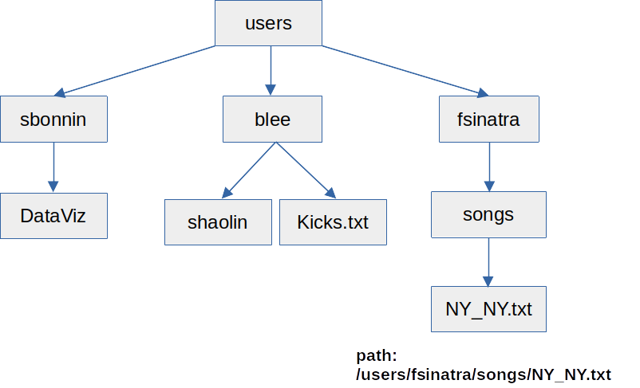
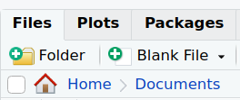
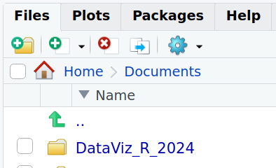

# Paths and directories

## Path and home directory

* The path of a file/directory is its **location/address** in the file system.

* Your home directory is the one that hosts the **user (your) data**: it is similar, although not identical, in all operating systems, for example:
  - */users/sbonnin* or */home/sbonnin* (Linux)
  - */Users/sbonnin* or */Home/sbonnin* (macOS)
  - *C:\\Users\\sbonnin* or *C:\\Home\\sbonnin* (Windows)
  
The starting "/" or "\\" is called the **root** directory. Directories branch downwards from the root directory, and can contain both files and subdirectories.

In the examples above, **sbonnin** is a subdirectory of **users** (or Users), and users starts at the root.

Example of a *tree* / organization of directories:

## Create the workshop directory

We will now create a folder/directory, where we will store what we produce during this course.

Go to the **Files** tab in the bottom-right corner: by default, this will be set to your **Home**.

You can navigate through the *tree* of files and directories by double clicking one folder name, to enter it, and by clicking on the **double dot ".."** to go back.

Choose the folder under which you would like to save the workshop's work.

For example, you can create it right under **Home -> Documents** (or anywhere else that you will remember, as we do not have the same folder structures). 

Click on "Home" and then on "Documents":

Create a folder called **"DataViz_R_2024"** by clicking on the **"+Folder"** icon.

You should now see a new folder:

Click on the newly created "DataViz_R_2024" folder, still under the "Files" tab, so you enter it. 

Click on the **"More file commands button"**: 

Click on **"Set As Working Directory"**:

The [working directory](https://en.wikipedia.org/wiki/Working_directory) is where R will, by default, find files to read, and that is where it will also save files and figures, if another location/path is not specified.

