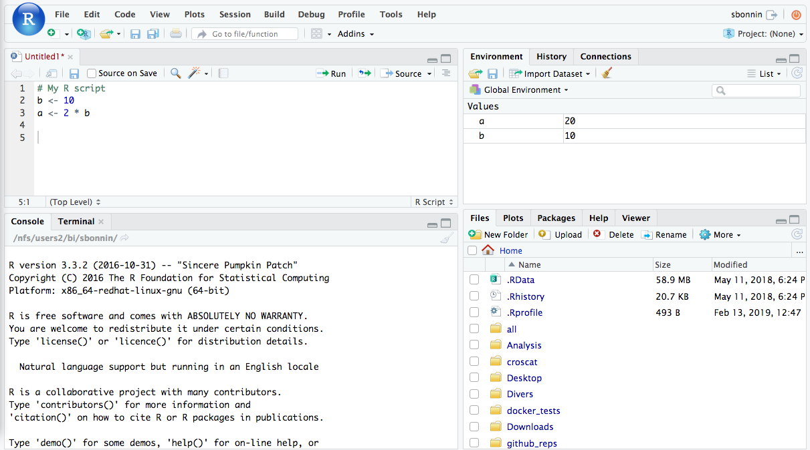

# What is RStudio (Posit)?

* Free and open source IDE (Integrated Development Environment) for R

* Available for Windows, Mac OS and LINUX


## RStudio interface

* 4 panels:
	+ **top-left**: scripts and files
	+ **bottom-left**: R console Linux-line terminal / command-line
	+ **top-right**: environment, history, connections, tutorial
	+ **bottom-right**: tree of folders and files, plots/graphs window, packages, help window, viewer, presentation



## The R console

The R **console** (bottom-left panel) is where the magic happens!

It is where the user/programmer/you will **interact** with R.

Let's give it a try. Type (or copy-paste) the following in the console (bottom-left panel), and hit the **Enter/Return** key:


```{r, eval=F}
getwd()
```

**getwd()** is a function. Remember that functions are followed by **parenthesis/round brackets**.

Upon clicking **Enter/Return**, you are asking the R kernel to **execute the function**.

What R returns is the **response/result** after executing the function.

The getwd() function retrieves and outputs your current working directory.

Let's try to interact a bit more with the console: copy-paste the following, and hit Enter/Return:

```{r, eval=F}
7*3
```

R gives you the results of this simple multiplication.

**USEFUL TIP**

In the console, press the **up arrow** key : this goes **back to the previous commands/lines** you wrote and sent in the console.


