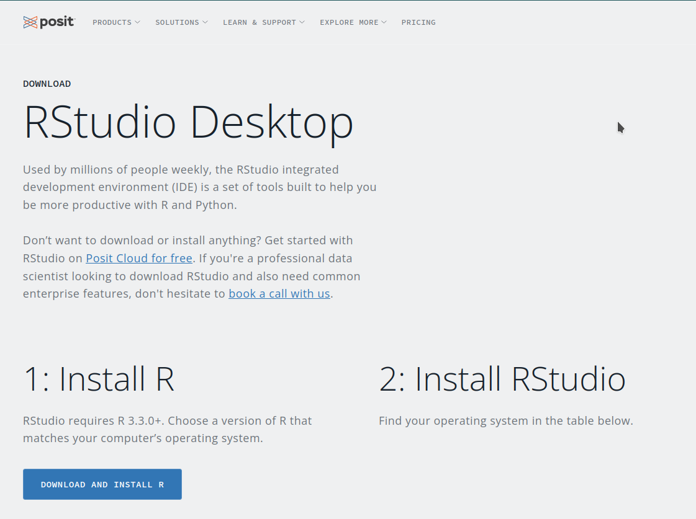
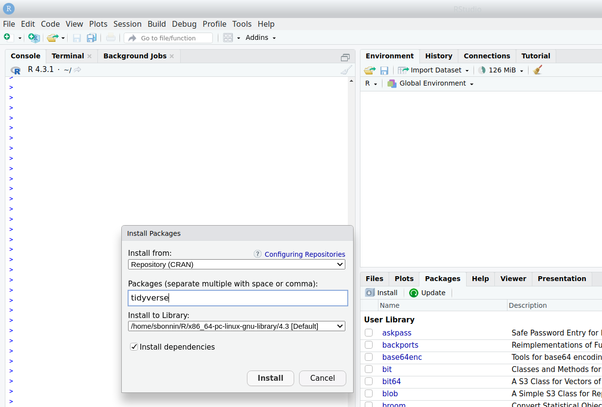
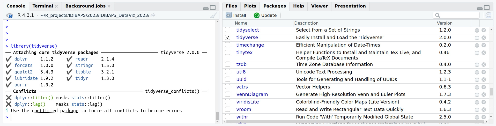

# Setup

## Install R and RStudio/Posit

Follow the instructions and relevant links on the [Posit/RStudio website](https://posit.co/download/rstudio-desktop/) to install both R and RStudio Desktop:



Installation instructions depend on the operating system installed on your computer.

The next table provides a summary of links to follow, depending on the operating system:

| Opereating system | R | RStudio desktop |
|:---:|:---:|:---:|
| Windows | https://cran.rstudio.com/bin/windows/ | [Windows 10/11](https://download1.rstudio.org/electron/windows/RStudio-2023.06.2-561.exe) |
| macOS | https://cran.rstudio.com/bin/macosx/ | [macOS 11+](https://download1.rstudio.org/electron/macos/RStudio-2023.06.2-561.dmg) |
| Linux (Debian) | https://cran.rstudio.com/bin/linux/debian | [Ubuntu 20 / Debian 11](https://download1.rstudio.org/electron/focal/amd64/rstudio-2023.06.2-561-amd64.deb) |
| Linux (Ubuntu) | https://cran.rstudio.com/bin/linux/ubuntu | [Ubuntu 20 / Debian 11](https://download1.rstudio.org/electron/focal/amd64/rstudio-2023.06.2-561-amd64.deb), [Ubuntu 22](https://download1.rstudio.org/electron/jammy/amd64/rstudio-2023.06.2-561-amd64.deb) |
| Linux (Fedora / Redhat) | https://cran.rstudio.com/bin/linux/fedora | [Fedora 19 / Red Hat 7](https://download1.rstudio.org/electron/centos7/x86_64/rstudio-2023.06.2-561-x86_64.rpm), [Fedora 34 / Red Hat 8](https://download1.rstudio.org/electron/rhel8/x86_64/rstudio-2023.06.2-561-x86_64.rpm), [Fedora 36 / Red Hat 9](https://download1.rstudio.org/electron/rhel9/x86_64/rstudio-2023.06.2-561-x86_64.rpm) |

If you are using a Linux OS, you will need to install additional packages:

**Debian, Ubuntu (DEB packages):**
<br>
libcurl4-openssl-dev libssl-dev libxml2-dev libfontconfig1-dev libharfbuzz-dev libfribidi-dev libfreetype6-dev libpng-dev libtiff5-dev libjpeg-dev

**Fedora, CentOS, RHEL (RPM packages):**
<br>
libxml2-devel libcurl-devel fontconfig-devel openssl-devel  libjpeg-devel  libtiff-devel  libpng-devel

Guides for Linux package installation (you may need to contact your IT department for permissions):

* [Install a DEB package](https://help.ubuntu.com/kubuntu/desktopguide/C/manual-install.html)
* [Install an RPM package](https://access.redhat.com/solutions/1189)

## Install R packages

Once R and RStudio are successfully installed, Open RStudio:


In the bottom-right panel, click on tab “Packages” and then “Install” . 
In the “Packages” box, write “tidyverse” and click “Install”. It should look like the below image:


 


The installation of this first package will take several minutes.

Repeat the process for the following packages:

* ggrepel
* pheatmap
* plotly
* openxlsx
* VennDiagram

Note: install packages one by one, as it eases debugging in case of installation failure.

If installation of the first package (tidyverse) repeatedly fails, try and install the following packages independently:

* tidyr
* dplyr
* ggplot2
* stringr

## Check setup

In order to make sure that the setup is successful, click again on tab "Packages" of the bottom-right panel, and **tick packages that you just installed**, like the "tidyverse" package in that example:

 

If no error (in red) appear in the console (bottom-left panel), installation should be ok.

**CHECK**

Copy-paste the following line of code in the console (bottom-left panel) and click on Enter / Return. You should be able to see the scatter plot appear on the "Plots" tab in the bottom-right panel !

```{r, eval=T, echo=F, include=F}
library(tidyverse)
```

```{r, eval=T, echo=T, cache=TRUE}
diamonds %>% 
  dplyr::select(carat, price, clarity) %>%  
  ggplot(aes(x=carat, y=price, col=clarity)) + geom_point()
```

