--- 
title: "R for beginners: Introduction to data visualization with R and ggplot2: from data to publication-quality figures"
subtitle: "IDIBAPS Stepping-stone training program 2025"
author: "Sarah Bonnin, Leone Albinati"
date: "`r Sys.Date()`"
site: bookdown::bookdown_site
output: bookdown::gitbook
documentclass: book
bibliography: [book.bib, packages.bib]
biblio-style: apalike
link-citations: yes
---

# Welcome

<h3> Dates, time & location </h3>

* Dates: October 21st and 30th, 2025
* Time:  9:30-13:00
* Location: [IDIBAPS](https://www.clinicbarcelona.org/en/idibaps)

<h3> Instructors </h3>
 
[Sarah Bonnin](https://www.linkedin.com/in/sarahbonnin/) 

Manager, Discovery & Translational Science consulting at [Clarivate](https://clarivate.com/).

[Leone Albinati]()

PhD student at the [Beekman lab at CRG](https://www.crg.eu/en/programmes-groups/beekman-lab)

<h3>Prerequisites</h3>

The workshop is open to anyone with **no (or little) prior programming experience**.

Attendees must however **feel comfortable enough with their own computer to install programs** (and debug their installation, when needed) and **locate folders and files**.

<h3> Learning objectives</h3>

Attendees will:

* Gain a high-level understanding of data import, manipulation and graphing with R and RStudio. 
* Be able to produce and save a variety of publication-quality graphs (among others: boxplots, scatter plots, barplots).

<h3>Learning outcomes</h3>

* Identify and use RStudio panels (console, scripts, folders and files panels).
* Locate useful resources to learn more and know where to seek help.
* Import data from files into R.
* Manipulate and prepare (filter, select) data.
* Produce graphs:
  * Create a plot from “recipes”.
  * Change basic parameters (color, font size, point shape, title, etc.).
  * Export high-quality graphs in different formats (pdf, jpeg, png).

<h4>What this workshop is **NOT**:</h4>

* A programming class.
* A design class.

<h4>What this workshop is:</h4>

* An introduction to R and to RStudio software.
* An introduction to data visualization.
* A teaser to - hopefully - make you want to learn how to program in R!

<h3>Tentative agenda</h3>

Day 1 & 2: 9:30-13:00.
<br>
~15-20' break around 11:15-11:30.

* Welcome and set up
* Introduction to R and RStudio (Posit)
* Paths and directories
* R basics
* Data import
* ggplot2:
  * Introduction, concept
  * Scatter plots
  * Barplots
  * Boxplots
  * Fine-tuning font
  * Colors
  * Faceting
* Data filtering and wrangling:
  * select
  * filter
  * rename
* More ggplots
* Interactive plots with {plotly}
* More advanced data manipulation:
  * the pipe operator
  * from wide to long format
* Heatmaps with {pheatmap}
* Demo volcano plots

   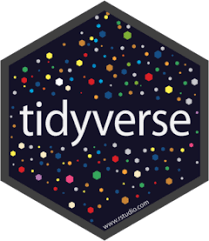

<!--chapter:end:index.Rmd-->

# Setup

## Install R and RStudio/Posit

Follow the instructions and relevant links on the [Posit/RStudio website](https://posit.co/download/rstudio-desktop/) to install both R and RStudio Desktop:

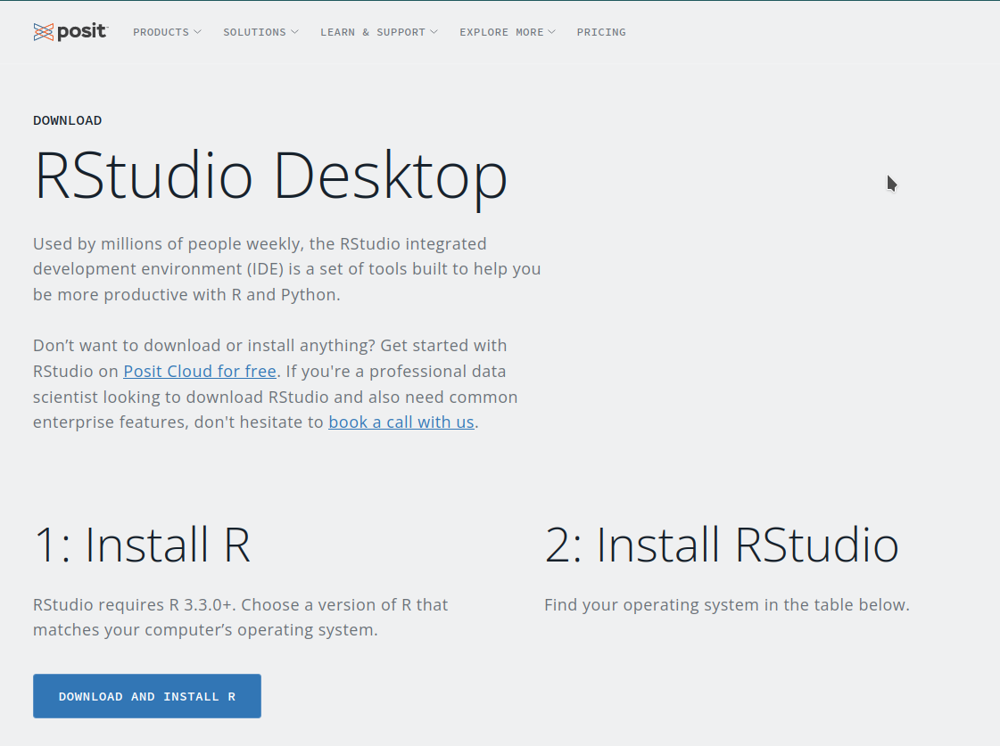

Installation instructions depend on the operating system installed on your computer.

The next table provides a summary of links to follow, depending on your operating system:

| Opereating system | R | [RStudio desktop](https://posit.co/download/rstudio-desktop/) |
|:---:|:---:|:---:|
| Windows | https://cran.rstudio.com/bin/windows/ | [Windows 10/11](https://download1.rstudio.org/electron/windows/RStudio-2025.09.1-401.exe) |
| macOS | https://cran.rstudio.com/bin/macosx/ | [macOS 13+](https://download1.rstudio.org/electron/macos/RStudio-2025.09.1-401.dmg) |
| Linux (Debian) | https://cran.rstudio.com/bin/linux/debian | [Ubuntu 22 / Debian 12](https://download1.rstudio.org/electron/jammy/amd64/rstudio-2025.09.1-401-amd64.deb) |
| Linux (Ubuntu) | https://cran.rstudio.com/bin/linux/ubuntu | [Ubuntu 24](https://download1.rstudio.org/electron/jammy/amd64/rstudio-2025.09.1-401-amd64.deb) |
| Linux (Fedora / Redhat) | https://cran.rstudio.com/bin/linux/fedora | [Fedora 41](https://download1.rstudio.org/electron/rhel9/x86_64/rstudio-2025.09.1-401-x86_64.rpm), [Red Hat 9](https://download1.rstudio.org/electron/rhel9/x86_64/rstudio-2025.09.1-401-x86_64.rpm), [Red Hat 10](https://download1.rstudio.org/electron/rhel9/x86_64/rstudio-2025.09.1-401-x86_64.rpm) |

If you are using a Linux OS, you will need to install additional packages:

**Debian, Ubuntu (DEB packages):**
<br>
libcurl4-openssl-dev libssl-dev libxml2-dev libfontconfig1-dev libharfbuzz-dev libfribidi-dev libfreetype6-dev libpng-dev libtiff5-dev libjpeg-dev

**Fedora, CentOS, RHEL (RPM packages):**
<br>
libxml2-devel libcurl-devel fontconfig-devel openssl-devel  libjpeg-devel  libtiff-devel  libpng-devel

Guides for Linux package installation (you may need to contact your IT department for permissions):

* [Install a DEB package](https://help.ubuntu.com/kubuntu/desktopguide/C/manual-install.html)
* [Install an RPM package](https://access.redhat.com/solutions/1189)

## Install R packages

Once R and RStudio are successfully installed, Open RStudio:


In the bottom-right panel, click on tab “Packages” and then “Install” . 
In the “Packages” box, write “**tidyverse**” and click “Install”. It should look like the below image:


 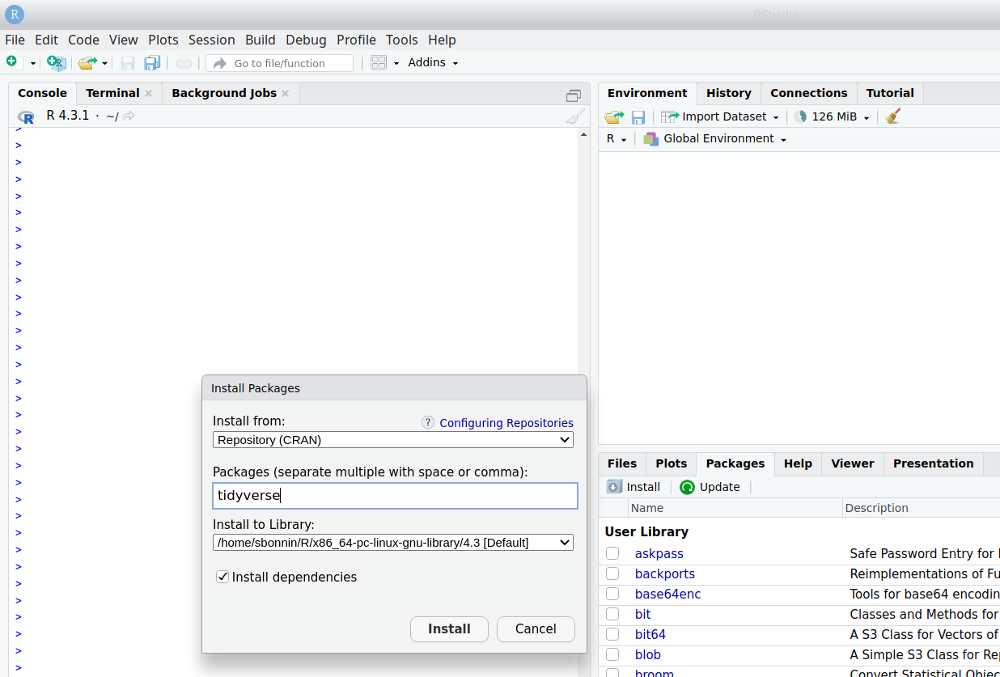


The installation of this first package will take several minutes.

Repeat the process for the following packages:

* ggrepel
* pheatmap
* plotly
* openxlsx
* VennDiagram
* ggExtra
* readxl
* ggsci

Note: install packages one by one, as it eases debugging in case of installation failure.

If installation of the first package (tidyverse) repeatedly fails, try and install the following packages independently:

* tidyr
* dplyr
* ggplot2
* stringr

## Check setup

In order to make sure that the setup is successful, click again on tab "Packages" of the bottom-right panel, and **tick packages that you just installed**, like the "tidyverse" package in that example:

 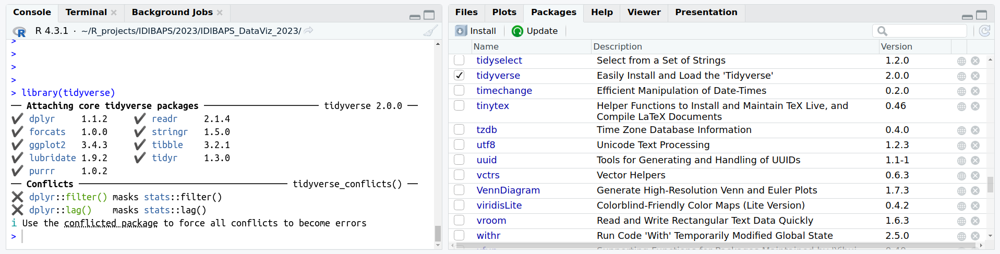

If no error (in red) appear in the console (bottom-left panel), installation should be ok.

**CHECK**

Copy-paste the following line of code in the console (bottom-left panel) and click on Enter / Return. You should be able to see the scatter plot appear on the "Plots" tab in the bottom-right panel !

```{r, eval=T, echo=F, include=F}
library(tidyverse)
```

```{r, eval=T, echo=T, cache=TRUE}
diamonds %>% 
  dplyr::select(carat, price, clarity) %>%  
  ggplot(aes(x=carat, y=price, col=clarity)) + geom_point()
```


<!--chapter:end:setup.Rmd-->

# R


## What is R ?

* Programming language and environment for **data manipulation**, **statistical computing**, and **graphical display**.

* Implementation of the S programming language

* Created at the University of Auckland, New Zealand:
	+ Initial version released in 1995
	+ Stable version released in 2000
* **Free and open source !**
	+ https://www.r-project.org/

* Interactive, flexible

* Very active community of developers and users!
	+ Many resources and forums available

## Functions & packages

### Functions

A function in R is a piece of code that takes an **input** (user data, **parameters**), processes some **calculation**, and **outputs** data.

For example: the **mean()** function would take a vector / series of numbers as an input, calculate and output their average.

Functions can take **arguments/parameters**. In the example above, the main argument to mean() would be a series of numbers given by the user.

In R code, you can identify functions with the parenthesis ("round brackets") following their name.


### Packages

#### What are packages?

A package in R stores, in a standardized format, a set of functions, data and documentation.

They are developed and shared by the community of R users and developpers, and vary in size and complexity.

Packages are stored in a **library**.

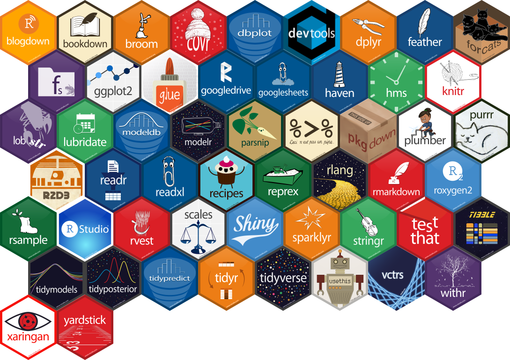

[source](https://www.mitchelloharawild.com/blog/2018-07-10-hexwall_files/figure-html/final-1.png)

Packages are mostly available in public **repositories** or open-source platforms such as:

- CRAN (general repository for any type of data analysis).
- Bioconductor (initially specialized in high throughput data analysis / bioinformatics)
- GitHub

Anyone can create a package and stored it locally; creating packages is a great way to **share code**.

The previous function, **mean()**, is part of the **{base}** package that is available by default.

#### The "tidyverse"

*The [tidyverse](https://www.tidyverse.org/) is an opinionated collection of R packages designed for data science. All packages share an underlying design philosophy, grammar, and data structures.*

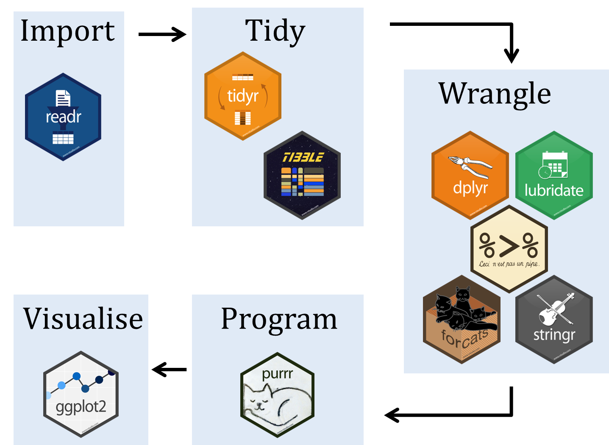

[source](hhttps://ajsmit.github.io/Intro_R_Official/tidy.html)

**Why do we use the tidyverse packages in this course?**

* Easier to understand / more intuitive vocabulary: better for beginners.
* More "modern" style of coding.
* Uniform in style and logic across data manipulation and visualization.
* Very (and increasingly) popular

In this course, we will use in particular, and in that order:

* [{readr}](https://readr.tidyverse.org/) for importing / exporting files.
* [{ggplot2}](https://ggplot2.tidyverse.org/) for data visualization.
* [{dplyr}](https://dplyr.tidyverse.org/) for (simple) data manipulation and selection.

<!--chapter:end:Rintro.Rmd-->

# What is RStudio (Posit)?

* Free and open source IDE (Integrated Development Environment) for R

* Available for Windows, Mac OS and LINUX

 


## RStudio interface

* 4 panels:
	+ **top-left**: scripts and files
	+ **bottom-left**: R console Linux-line terminal / command-line
	+ **top-right**: environment, history, connections, tutorial
	+ **bottom-right**: tree of folders and files, plots/graphs window, packages, help window, viewer, presentation


## The R console

The R **console** (bottom-left panel) is where the magic happens!

It is where the user/programmer/you **interacts** with R.

Let's try. 

Type (or copy-paste) the following in the console (bottom-left panel), and hit the **Enter/Return** key:


```{r, eval=F}
getwd()
```

* **getwd()** is a function. Remember that functions are followed by **parenthesis/round brackets**.

* Clicking **Enter/Return** sends the function to the R kernel and **executes/interprets the function**.

* R returns the **response/result** after the function has completed.

**getwd()** retrieves and outputs your current working directory/path (we will explain paths in the next section).

Let's try again.

Copy-paste the following, and hit Enter/Return:

```{r, eval=F}
7*3
```

R gives you the results of this simple multiplication.

**USEFUL TIP**

In the console, press the keyboard **up arrow** key : this goes **back to the previous commands/lines** you wrote and sent in the console.


<!--chapter:end:rstudio.Rmd-->

# Paths and directories

## Path and home directory

* The path of a file/directory is its **location/address** in the file system.

* The home directory is the personal directory assigned to the **user (you)**: path and name to the home directory are similar, although not identical, in all operating systems, for example:
  - */users/sbonnin* or */home/sbonnin* (Linux)
  - */Users/sbonnin* or */Home/sbonnin* (macOS)
  - *C:\\Users\\sbonnin* or *C:\\Home\\sbonnin* (Windows)
  
The initial "/" or "\\" is called the **root**, which is the **top-directory** of the hierarchical file system.

Directories branch from the root directory, and can contain both files and sub-directories.

In the examples above, **sbonnin** is sub-directory of **users** (or Users), which in turns is a sub-directory of the root.

Example of a *tree* / organization of directories:

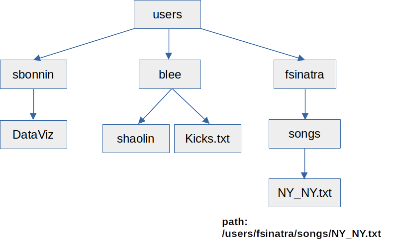


<!---
## Create the workshop directory

We will now create a folder/directory, where we will store what we produce during this course.

Go to the **Files** tab in the bottom-right corner: by default, this will be set to your **Home**.

You can navigate through the *tree* of files and directories by double clicking one folder name, to enter it, and by clicking on the **double dot ".."** to go back.

Choose the folder under which you would like to save the workshop's work.

For example, you can create it right under **Home -> Documents** (or anywhere else that you will remember, as we do not have the same folder structures). 

Click on "Home" and then on "Documents":

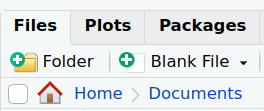

Create a folder called **"DataViz_R"** by clicking on the **"+Folder"** icon.

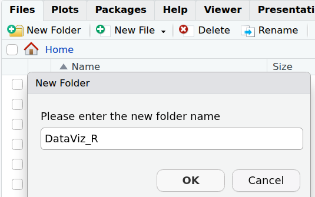

Click on the newly created "DataViz_R" folder under the "Files" tab, so as to enter it. 

Click on the **"More file commands button"**: 

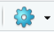

Click on **"Set As Working Directory"**:

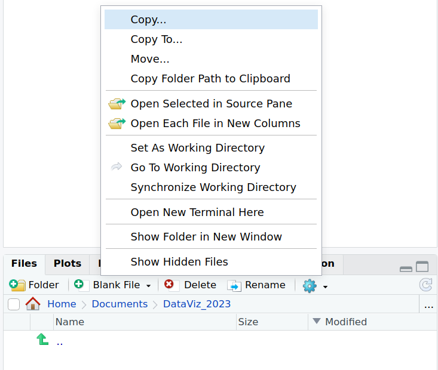

The [working directory](https://en.wikipedia.org/wiki/Working_directory) is where R will, by default, find files to read, and that is where it will also save files and figures, if another location/path is not specified.

-->

## RStudio "Projects"

"[RStudio projects](https://support.posit.co/hc/en-us/articles/200526207-Using-RStudio-Projects) are associated with R working directories. You can create an RStudio project:

* __In a brand new directory__
* In an existing directory where you already have R code and data
* By cloning a version control (Git or Subversion) repository
"

### Advantages

* When re-opening a project, all the environment (path, objects) is restored (no data loss)
* Multiple projects can be created in parallel, keeping objects and environment separated (no project "cross-contamination")

### Project for the course

We will create an RStudio "Project" for this workshop. This will allow us to stay organized and easily open the project and associated data.

To create a project:

* Go to File -> New Project...

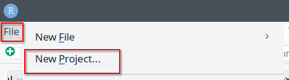

* Create Project: "New directory"

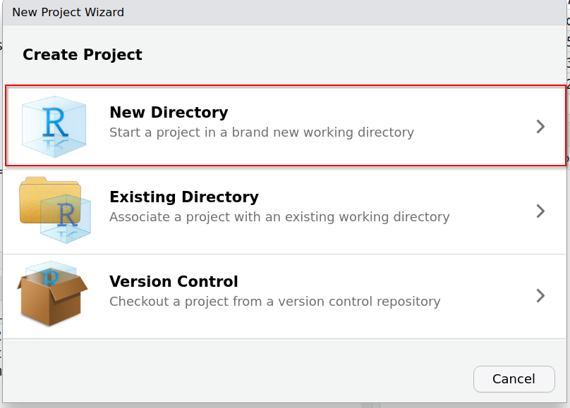

* Project Type: "New project"

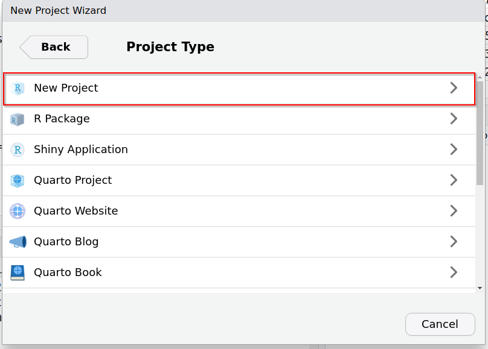

* Create New Project:
  * Choose directory name, e.g. **`DataViz_R`**
  * Navigate to the directory where you want the R project to be created and stored. Here, we can choose **`~/Documents`**:

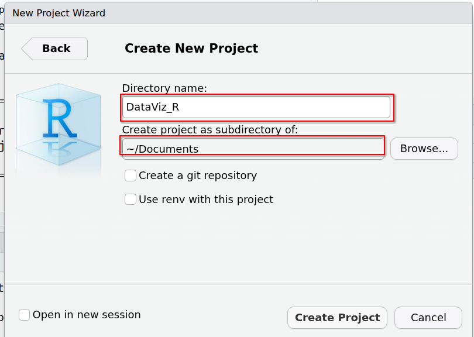

* A new session has now been started, where the working directory is automatically set to the directory where you chose your project to be stored:

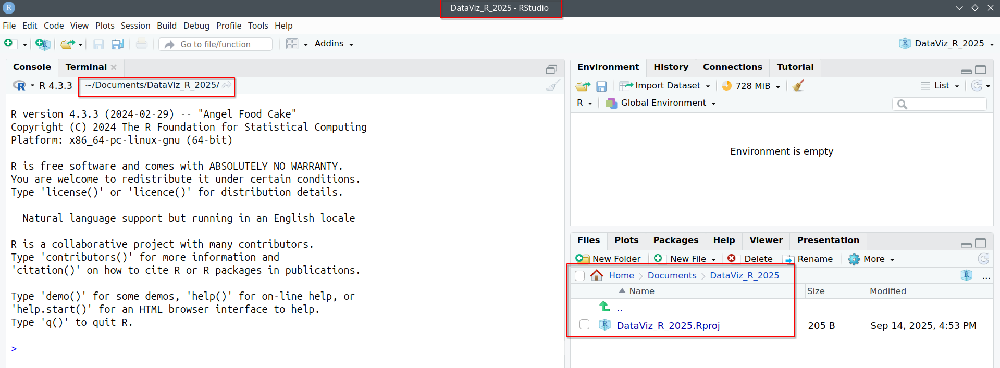

### Leave the project

When you close the RStudio project, make sure you save .RData file (environment):

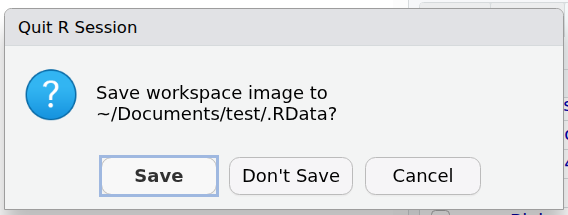

We will see it in practice as we finish day 1.

### Re-open the project

In the project folder, double-click on the **.Rproj** file, e.g. DataViz_R.Rproj:

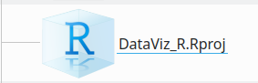

Note that, when re-opening a project, all environment is restored but you will **need to reload packages**.


<!--chapter:end:pathdirectories.Rmd-->

# R basics

In this section, we will cover very basic notions of R programming.

## Arithmetic operators

R is a programming language with a focus on statistics. While it can be used for very complex tasks, it can also be used as a simple **calculator**, as previously demonstrated.

The following arithmetic operators can be used for these tasks:

| Operator  | Function      |
|:--------: |:-------------:|
|     +     | addition      |
|     -     | subtraction   |
|     /     | division      |
|     *     | multiplication|
|  ^ or **  | exponential   |

In the R terminal, you can type the following:

```{r, eval=FALSE}
10-2
```

And hit **Enter** for R to interpret the command, and output the result.

Then try the following:

```{r, eval=F}
3*5
```

or:

```{r, eval=F}
(4*12)/5
```


## Objects in R

We have thus far used the console interactively receiving instanteneous results from R **in the console.**

Data/output of commands can also be stored in **objects**.

Everything that stores any kind of data in R is an **object**:

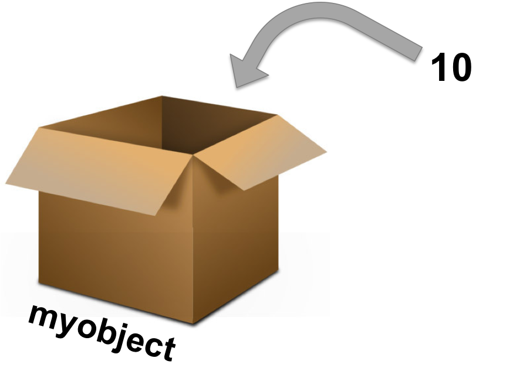

When data is stored in objects, it can easily be **manipulated, modified, and reused.**

## Assigning data to an object

We will use an assignment operator to **assign (i.e. store) data to an object:**

You can use either **<-** or **=** (essentially the same).

Examples:

* Assigning/storing **10** to the object named **B**:

Copy-paste the following in the console, and hit Enter.

```{r}
B <- 10
```

Note that there is **no output** in the console. If you now type **B** in the R console, and hit Enter, what happens?

* Reassigning: modifying the content of an object:

```{r, eval=FALSE}
B <- 12
```

* You can also use an object to assign data to a new (or to the same) object: try the following in the console:

```{r, eval=FALSE}
B <- 12
A <- 5
A <- A + B
```

What values do A and B store now?


* You can see the objects you created in the upper-right panel in RStudio that is, the **environment**:

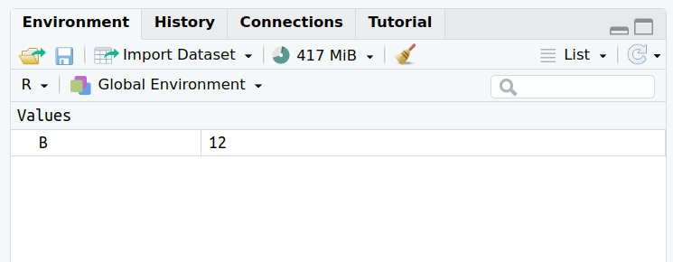

**How to name an object?**

Naming an object in R is flexible, if you follow a few base rules.

You can use:

* letters (note that object names case sensitive: **A** and **a** are NOT the same)
* numbers (although the object name **cannot start with a number**)
* underscores **\_**

What you CANNOT use:

* Spaces
* Most special characters

## Data types

Several data types exist in R: 

* numeric (numbers)
* character (strings)
* logical / boolean (TRUE / FALSE)
* factor (categories)

For this introductory course, we will mainly see and manipulate numeric (numbers) and character (strings) data types.

A character or string of characters must be assigned with simple or double **quotes ("")**, for example:

```{r}
myobject <- "training"
```

You should now see in the environment (upper-right corner) the new object called **training**.

Now try to assign the same object **without the quotes**:

```{r, eval=F}
myobject <- training
```

What happens?


<!--chapter:end:Rbasics.Rmd-->

# Import data / read files / scripts

In this section, we will learn how to **import the content of a file** in R using the **{readr}** package (part of the **{tidyverse}**).

## Fetch workshop files

Let's copy locally a few files prepared for this workshop.

* Go to: <a href="https://github.com/sarahbonnin/DataViz_source_files" target="_blank">https://github.com/sarahbonnin/DataViz_source_files</a>

* Download the ZIP archive, as follows:

Click on  -> Download ZIP:


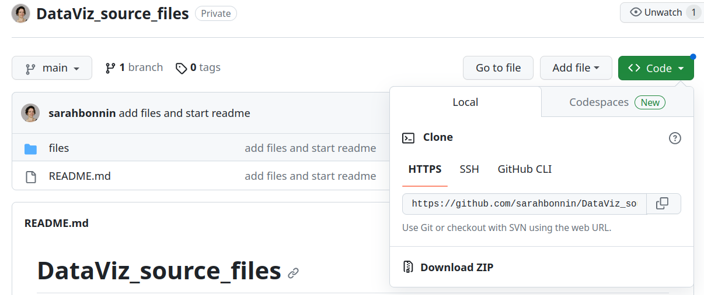

* Save the archive in the course folder (**DataViz_R**)

* Extract the archive (click right on the archive and you should see some extraction options).

What is extracted from the archive is the **DataViz_source_files-main** folder, which in turns contains a **files** folder: this contains the files we need for the course.

The **path** to fetch the files is the following (remember that the first piece is *OS/user* dependent):

*/your_home_directory/*DataViz_R/**DataViz_source_files-main/files**

e.g.

/users/sbonnin/DataViz_R/**DataViz_source_files-main/files**

## Import / read in data

### Load package into environment

From RStudio interface, in the **bottom-right panel** and **Packages** tab, search for the package name and **tick the box**:

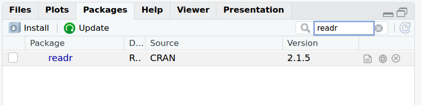

From the R console:

```{r, echo=T, eval=F, message=F, warning=F}
library(readr)
```

### from CSV

Let's now import the content of a first file in our environment.

There are several ways we can specify the path / location of a file:

* Using the "absolute path":

```{r, echo=T, eval=F, message=F, warning=F}
# absolute path
geneexp <- read_csv(file="~/Documents/DataViz_R/DataViz_source_files-main/files/expression_20genes.csv")
```

* Using the "relative path" (i.e. relative to where the session and R project are currently located), e.g.:

```{r, echo=T, eval=T, message=F, warning=F}
# relative path (this assumes you are in the course folder)
geneexp <- read_csv(file="DataViz_source_files-main/files/expression_20genes.csv")
```

Because your **working directory** is **DataViz_R**, R can find the **DataViz_source_files-main** without needing the full path (**relative vs absolute path**).

The content of file **expression_20genes.csv** is now stored in the object named **geneexp**.

The function also outputs some information about the data you are importing:

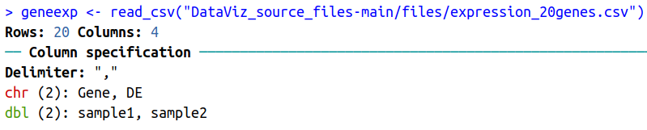

Such as that:

* The data contains 20 rows (observations), and 4 columns (variables).
* Out of these 4 columns:
  * 2 contain characters (<span style="color: red;">chr</span>): **Gene** and **DE**.
  * 2 contain numbers (<span style="color: green;">dbl</span> for "double"): **sample1** and **sample2**

Notes:

* Objects you create can be found in the **Environment** tab in the upper-right panel.
* If you click on an object name in the **Environment** tab, it will open on the upper-left panel. Let's try with **geneexp**:

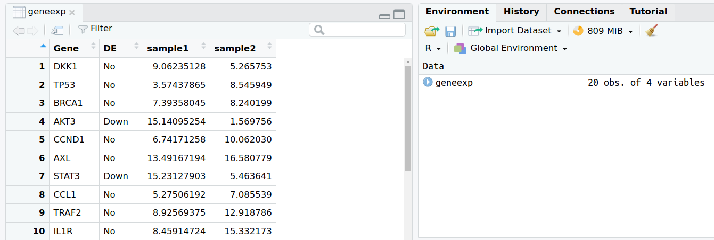

### from Excel

{tidyverse} provides the {readxl} package with functions to read in Excel files.

Although working with text files (.txt, .csv, .tsv etc.) is a better practice, you can import Excel files using the **read_excel()** function.

First, load the {readxl} package (bottom-right panel -> Packages -> search and tick readxl, or from the console, as shown below).

```{r}
library(readxl)
# Relative path:
read_excel(path="DataViz_source_files-main/files/expression_20genes.xlsx")
```

If your Excel file contains multiple sheets, you can specify the sheet name using the **sheet=** parameter:

```{r}
read_excel(path="DataViz_source_files-main/files/expression_20genes.xlsx",
           sheet="tab1")
```

**Note: parameters in a function are comma-separated**:

* *path* is a first parameter
* *sheet* is a second parameter

## Scripts

A **script** is a text file containing a set of **commands** and **comments**.

It can be saved, re-used later, and shared.

It is good practice to create a script and save all commands: let's create a script for this course.

*Go to File -> New File -> R script*

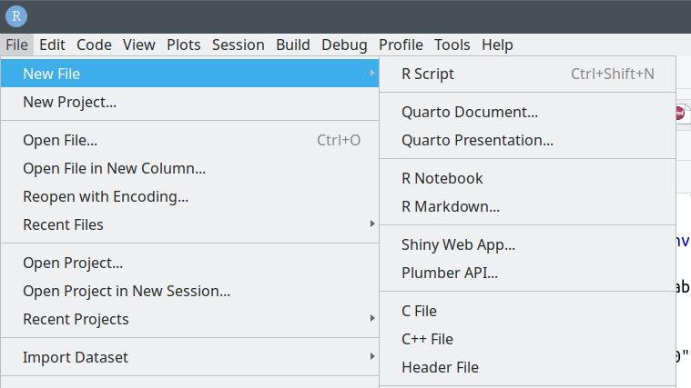

A new window will open in the upper-left panel.

Save the file in the course folder (you can name it, for example, *workshop.R*)

**Copy commands you will use during the course, and do not forget to save changes regularly!**

**TIP**: you can send a line or selected lines from the script to the console without copy-pasting: press CTRL+ENTER when highlighting the row.

**Note that, when you re-open an RStudio projects, scripts/files that were left open will open automatically**

<!--chapter:end:dataimport.Rmd-->

# ggplot2

```{r global_options, include=FALSE}
knitr::opts_chunk$set(fig.width=5, fig.height=4,
                      echo=TRUE, warning=FALSE, message=FALSE)
```

* Graphing package inspired by the **G**rammar of **G**raphics work of Leland Wilkinson:
  
* *The Grammar of Graphics is based on the idea that every graphic can be broken down into a series of components or layers. These components include the data, the aesthetic mapping, the geometric shapes, the statistical transformation, and the scales.* [source](https://medium.com/aiskunks/data-visualization-grammar-of-graphics-fccf78379b52)

* Flexible, versatile, customizable.

* Well documented.


*image from https://www.cedricscherer.com/img/ggplot-tutorial/overview.png*


## Getting started

A ggplot graph needs at least 3 components:

* **Data**: that is the source data that we want to represent.
* **Aesthetics** mappings: they describe what will be visualized from **data**. What are you trying to show?
* **Geometrics**: functions that represent what we see in the graph: lines, points, boxes etc. for example:
  * geom_point()
  * geom_lines()
  * geom_histogram()
  * geom_boxplot()
  * geom_bar()
  * geom_smooth()
  * geom_tiles()

The base structure is the following:

**ggplot(\<DATA\>, \<AESTHETICS\>) + \<GEOMETRICS\>**


For example if we want to represent **column1** (on the x axis) and **column2** (on the y axis) of **data** as **points**, we can use the following structure:

```{r, eval=F, echo=TRUE}
ggplot(data=dataframe, mapping=aes(x=column1, y=column2)) + geom_point()
```

This will be our template as we explore different types of graphs.

We can add **more layers and components** to this base structure to customize the plot: we will see examples throughout this course.

## Scatter plot

### Base plot

We can start from the **geneexp** object, that contains data from *expression_20genes.csv*: we will represent **sample1** on the x axis and **sample2** on the y axis.

The base layer is built as follows (Copy-paste this in the console, and hit Enter):

```{r, eval=T}
ggplot(data=geneexp, mapping=aes(x=sample1, y=sample2))
```

As you can see, nothing is plotted yet, but the base is set.

We then add a geometrics **geom_point()** to the base layer: this **tells ggplot to produce a scatter/point plot**:

```{r, eval=T}
# This line is a comment: a comment is not interpreted by R.
# Example of a scatter plot: add the geom_point() layer
ggplot(data=geneexp, mapping=aes(x=sample1, y=sample2)) + 
  geom_point()

# Note that the new line is NOT necessary after the "+": it is done for clarity / readability.
```

Please, copy this code to your script, and execute it!

Your plot should appear in the "Plots" tab in the bottom-right panel.

### Customize the points

**geom_point()** can take parameters, including the point color and size:

Color all points in red:

```{r}
ggplot(data=geneexp, mapping=aes(x=sample1, y=sample2)) + 
  geom_point(color="red")
```

Increase point size (default size is 1.5):

```{r}
ggplot(data=geneexp, mapping=aes(x=sample1, y=sample2)) + 
  geom_point(color="red", size=2.5)
```

How do you know how a function works?

Functions in **ggplot2** (and **tidyverse** in general) are richly documented.

While documentation/help pages can be quite technical it is a good practice to take a look at them.

You can access the help page of a function in the **Help** tab in the bottom-right panel. Give it a try with "geom_point":

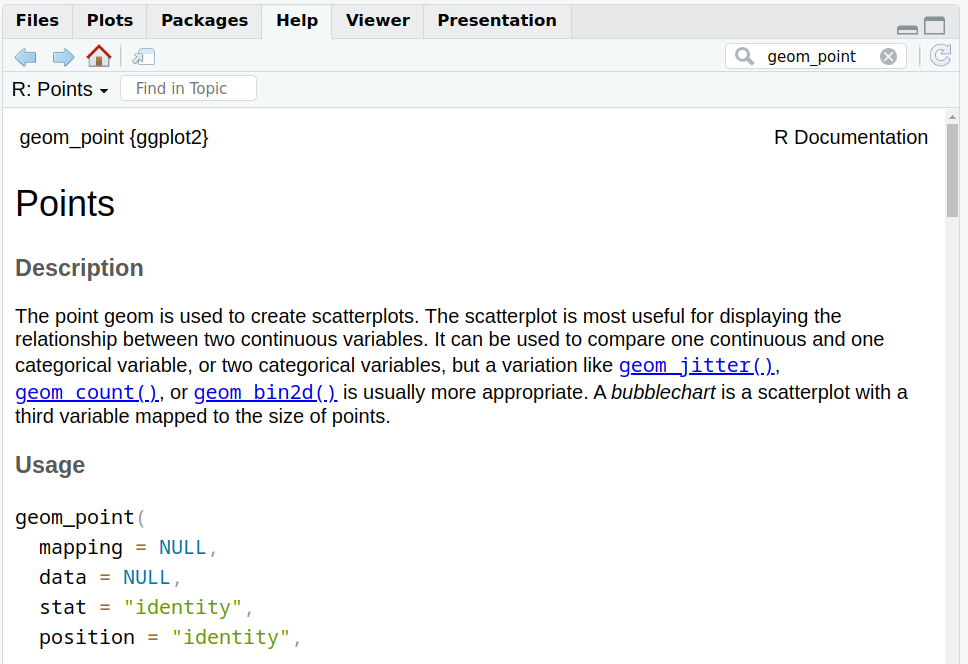


Back to our customization: we can change the point shape by setting the **shape** parameter in **geom_point()**.

Points can become, for example, triangles:

```{r}
ggplot(data=geneexp, mapping=aes(x=sample1, y=sample2)) + 
  geom_point(color="red", size=2.5, shape="triangle")
```

See more options in the following image:


*Image from ggplot2 documentation*

Note that you can also replace the points by any character, the following way:

```{r}
ggplot(data=geneexp, mapping=aes(x=sample1, y=sample2)) + 
  geom_point(color="red", size=2.5, shape="$")
```

### Add more layers

We can add more **layers** to the plot, using the same structure (**+ layer_name()**)

#### ggtitle()

Add a title using the **ggtitle()** layer:

```{r}
ggplot(data=geneexp, mapping=aes(x=sample1, y=sample2)) + 
  geom_point(color="red", size=2.5, shape="diamond") +
  ggtitle(label="my first ggplot")
```

**label** is a parameter of **ggtitle()** function.

#### Background

Not a big fan of the default grey background?


This is the default "theme", but there are [more options](https://ggplot2.tidyverse.org/reference/ggtheme.html).

Examples:

```{r}
ggplot(data=geneexp, mapping=aes(x=sample1, y=sample2)) + 
  geom_point(color="red", size=2.5, shape="diamond") +
  ggtitle(label="theme grey (the default theme)") +
  theme_grey()
```

```{r}
ggplot(data=geneexp, mapping=aes(x=sample1, y=sample2)) + 
  geom_point(color="red", size=2.5, shape="diamond") +
  ggtitle(label="theme linedraw") +
  theme_linedraw()
```

```{r}
ggplot(data=geneexp, mapping=aes(x=sample1, y=sample2)) + 
  geom_point(color="red", size=2.5, shape="diamond") +
  ggtitle(label="theme bw = black and white") +
  theme_bw()
```

```{r}
ggplot(data=geneexp, mapping=aes(x=sample1, y=sample2)) + 
  geom_point(color="red", size=2.5, shape="diamond") +
  ggtitle(label="theme void") +
  theme_void()
```

Good webpage to check the different backgrounds:
https://ggplot2-book.org/themes#sec-theme

You can also change some settings globally as you use a new theme, e.g. 

* *base_size*: by default, 11.
* *base_family*: the font (uses by default arial or sans). To check the fonts that are available, type *systemfonts::system_fonts()$family*
* *base_line_size*: by default, base_size/22.
* *base_rect_size*: by default, base_size/22


```{r}
# get full list of available fonts in your system with: 
ggplot(data=geneexp, mapping=aes(x=sample1, y=sample2)) + 
  geom_point(color="red", size=2.5, shape="diamond") +
  ggtitle(label="my first ggplot") +
  theme_bw(base_size=18, base_family = "Laksaman", base_line_size = 2, base_rect_size = 4)
```


## Save your plot

### From the RStudio interface

Before we dive into more graph types, let's pause and learn how to easily save the current plot.

In the "Plots" tab, click on "Export" and "Save as image":

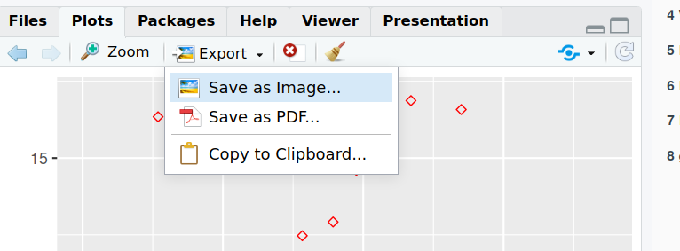

From that windows, you can:

* Pick an image format between: PNG, JPEG, TIFF, BMP, SVG, EPS.
* Choose where you want to **save the output file** (by default, R will propose the current working directory).
* Choose the **file name**.
* Set the dimensions, by either:
  * Setting the Width and Height of the figure (in pixels)
  * Moving the graph manually (bottom-right corner of the plot) until you obtain the size and proportions that you want.

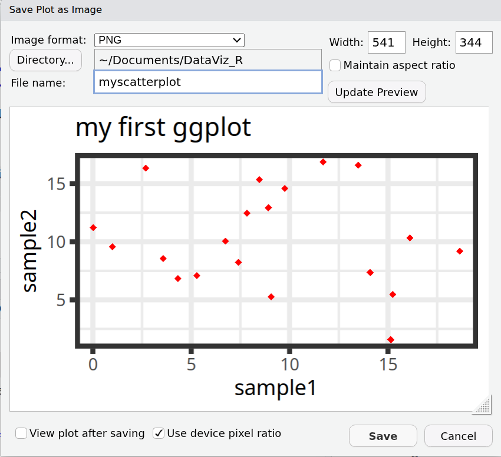

### From the console

The best way to save a plot to a few from the console, is using the ggsave function.

First, you need to save the plot to an object (if you don't, ggplot will create a file from the latest plot, which is fine too!).

```{r}
myplot <- ggplot(data=geneexp, mapping=aes(x=sample1, y=sample2)) + 
  geom_point(color="red", size=2.5, shape="diamond") +
  ggtitle(label="my first ggplot")
```

Many different formats are available:

* eps
* ps
* tex
* pdf
* jpeg
* tiff
* png
* bmp
* svg
* wmf

```{r}
ggsave(filename="myplot.png", plot=myplot, device="png")
```

You can specify the plot size units between inches "in", centimeters "cm", milimeters "mm" or pixels "px".

You can also specify the **dpi**, i.e. dots per inches.

If we take as an example the requirements of electronic image formats [for Nature publishing group](https://www.nature.com/nature/for-authors/final-submission):

"Layered Photoshop (PSD) or TIFF format (high resolution, 300–600 dots per inch (dpi) )"

We could save the plot as a file the following way:

```{r}
ggsave(filename="myplot.tiff", 
       plot=myplot, 
       device="tiff", 
       dpi=300, 
       units="in", 
       width=5, height=5)
```


## Exercise 1

Time for our first exercise! 

Starting from the same object **geneexp**:

1. Create a scatter plot of sample2 (x-axis) versus sample1 (y-axis).

<details>
<summary>
correction
</summary>

```{r}
ggplot(data=geneexp, mapping=aes(x=sample2, y=sample1)) + 
  geom_point()
```

</details>

<br>
2. Change the point color (blue) and size (2).

<details>
<summary>
correction
</summary>

```{r}
ggplot(data=geneexp, mapping=aes(x=sample1, y=sample2)) + 
  geom_point(color="blue", size=2)
```

</details>

<br>
3. Change the point shape ("square cross")

<details>
<summary>
correction
</summary>

```{r}
ggplot(data=geneexp, mapping=aes(x=sample1, y=sample2)) + 
  geom_point(color="blue", size=2, shape="square cross")
```

</details>

<br>
4. Add a title (of your choice).

<details>
<summary>
correction
</summary>

```{r}
ggplot(data=geneexp, mapping=aes(x=sample1, y=sample2)) + 
  geom_point(color="blue", size=2, shape="square cross") +
  ggtitle(label="my second ggplot")
```

</details>

<br>
5. Add a subtitle (wait: that's new! Check **ggtitle** help page and/or search the internet for "ggtitle subtitle" and see if you can find!)

<details>
<summary>
correction
</summary>

```{r}
ggplot(data=geneexp, mapping=aes(x=sample1, y=sample2)) + 
  geom_point(color="blue", size=2, shape="square cross") +
  ggtitle(label="my second ggplot", subtitle="nice blue squares")
```

</details>

<br>
6. Save your plot as a JPEG file, in the workshop folder, with dimensions 600X600 **pixels**.

<details>
<summary>
correction
</summary>

From the interface:

Bottom-right panel -> Plots tab -> Export -> ...

From the console:

```{r}
# first, save in an object
mybluescatterplot <- ggplot(data=geneexp, mapping=aes(x=sample1, y=sample2)) + 
  geom_point(color="blue", size=2, shape="square cross") +
  ggtitle(label="my second ggplot", subtitle="nice blue squares")

# then save with ggsave
ggsave(filename="myblueplot.jpg", plot=mybluescatterplot, 
       device="jpeg", 
       units="px", width=600, height=600)
```
</details>


## Scatter plots: more features

We will learn how to add extra levels of customizations to the plot.

### Labels

Let's label points with the genes they represent.

Two steps:

* set the **label** parameter, in the ggplot **aes()** function, pointing to the column that contains the labels
* add the **geom_text()** layer, to display the labels

```{r}
ggplot(data=geneexp, mapping=aes(x=sample1, y=sample2, label=Gene)) + 
  geom_point() +
  geom_text()
```

We can decrease or increase label size:

```{r}
ggplot(data=geneexp, mapping=aes(x=sample1, y=sample2, label=Gene)) + 
  geom_point() +
  geom_text(size=3)
```


We can adjust the position of the labels relative to the points, so they do not overlap, with **nudge_x** (moves the labels horizontally / on the **x** axis).

```{r}
ggplot(data=geneexp, mapping=aes(x=sample1, y=sample2, label=Gene)) + 
  geom_point() +
  geom_text(size=3, nudge_x=1.5)
```


<!---

You can overrule the mapping of colors to labels and keep all labels black, for example:

```{r}
ggplot(data=geneexp, mapping=aes(x=sample1, y=sample2, label=Gene)) + 
  geom_point() +
  geom_text(nudge_x=1.5, size=3, color="black")
```
--->

Note that {ggrepel} package can automate the automatic organization of labels, so they do not overlap:

* Load {ggrepel} to your R session
* Change **geom_text()** with **geom_repel_text()**

```{r, eval=T, echo=F}
library(ggrepel)
```

```{r}
ggplot(data=geneexp, mapping=aes(x=sample1, y=sample2, label=Gene)) + 
  geom_point() +
  geom_text_repel()
```

### Color and shape mapping

Point color and shape can be **modified conditionally, i.e. depend on another column / variable of the data**. 

This is called **mapping an aesthetic to a variable**.

Columns used to **conditionally color or shape the points** are set inside the **aes()** function.

Conditional **shape**:

```{r, fig.width=7}
ggplot(data=geneexp, mapping=aes(x=sample1, y=sample2, label=Gene, shape=DE)) + 
  geom_point() +
  geom_text(nudge_x=1.2, size=3)
```

Conditional **color**:

```{r, fig.width=7}
ggplot(data=geneexp, mapping=aes(x=sample1, y=sample2, label=Gene, color=DE)) + 
  geom_point() +
  geom_text(nudge_x=1.2, size=3)
```

TIP: remove the double labeling in the legend (a letter behind the point because both labels and colors are mapped to the same variable): set **show.legend=FALSE** in **geom_text()**:

```{r, fig.width=7}
ggplot(data=geneexp, mapping=aes(x=sample1, y=sample2, label=Gene, color=DE)) + 
  geom_point() +
  geom_text(nudge_x=1.2, size=3, show.legend=FALSE)
```

You can change the legend title with layer **scale_color_discrete**:

```{r, fig.width=7}
ggplot(data=geneexp, mapping=aes(x=sample1, y=sample2, label=Gene, color=DE)) + 
  geom_point() +
  geom_text(nudge_x=1.2, size=3, show.legend=FALSE) +
  scale_color_discrete(name="DiffExp")
```


<details>
<summary>
*More advanced (as reference, or if someone asks): how to change default colors:*
</summary>

Colors can be set manually using (yet another) layer: **scale_color_manual()**.

```{r, fig.width=7}
ggplot(data=geneexp, mapping=aes(x=sample1, y=sample2, label=Gene, color=DE)) + 
  geom_point() +
  geom_text(nudge_x=1.2, size=3) +
  scale_color_manual(values=c(Down="blue", No="black", Up="red"))
```

</details>

### Additional ticks

**geom_rug** creates a compact visualization along the axes to help read the information of individual cases. You can simply add it as an additional layer.

```{r}
ggplot(data=geneexp, mapping=aes(x=sample1, y=sample2)) + 
  geom_point(color="red", size=2.5, shape="diamond") +
  ggtitle(label="my first ggplot") +
  theme_linedraw() +
  geom_rug()
```

As usual, you can customize several parameters, such as:

* *sides*: sides where to draw the lines (**t**op, **b**ottom, **r**ight, **l**eft)
* *alpha*: opacity, ranges from 0 (transparent) to 1 (opaque).
* *linewidth*, *linetype*

```{r}
ggplot(data=geneexp, mapping=aes(x=sample1, y=sample2)) + 
  geom_point(color="red", size=2.5, shape="diamond") +
  ggtitle(label="my first ggplot") +
  theme_linedraw() +
  geom_rug(sides="tr", alpha=0.3, linewidth=1)
```

### Density estimates

**geom_density_2d** performs a 2D kernel density estimation and displays the results with contours.

```{r}
ggplot(data=geneexp, mapping=aes(x=sample1, y=sample2)) + 
  geom_point(color="red", size=2.5, shape="diamond") +
  ggtitle(label="my first ggplot") +
  theme_linedraw() +
  geom_density_2d()
```

Play with some of the parameters we already know:

```{r}
ggplot(data=geneexp, mapping=aes(x=sample1, y=sample2)) + 
  geom_point(color="red", size=2.5, shape="diamond") +
  ggtitle(label="my first ggplot") +
  theme_linedraw() +
  geom_density_2d(color="pink", alpha=0.5, linewidth = 2)
```


### Regression line

Add a regression line with **geom_smooth()**. A smoothed line can help highlight the dominant pattern/trend.

```{r}
ggplot(data=geneexp, mapping=aes(x=sample1, y=sample2)) + 
  geom_point(color="red", size=2.5, shape="diamond") +
  ggtitle(label="my first ggplot") +
  theme_linedraw() +
  geom_smooth()
```

Remove the confidence interval:

```{r}
ggplot(data=geneexp, mapping=aes(x=sample1, y=sample2)) + 
  geom_point(color="red", size=2.5, shape="diamond") +
  ggtitle(label="my first ggplot") +
  theme_linedraw() +
  geom_smooth(se=FALSE)
```

Different methods can be used to fit the smoothing line:

* "lm": linear model.
* "glm": generalized linear model.
* "gam": generalized additive model.
* "loess": local polynomial regression.
* A function (more advanced)

By default, the smoothing method is picked based on the size of the largest group across all panels.

```{r}
ggplot(data=geneexp, mapping=aes(x=sample1, y=sample2)) + 
  geom_point(color="red", size=2.5, shape="diamond") +
  ggtitle(label="my first ggplot") +
  theme_linedraw() +
  geom_smooth(se=FALSE, method="lm")
```

<details>
<summary>
*More advanced (as reference, or if someone asks): add correlation coefficient:*
</summary>

You can add the correlation coefficient between the 2 variables, using another function from the {ggpubr} package:

```{r}
ggplot(data=geneexp, mapping=aes(x=sample1, y=sample2)) + 
  geom_point(color="red", size=2.5, shape="diamond") +
  ggtitle(label="my first ggplot") +
  theme_linedraw() +
  geom_smooth() +
  ggpubr::stat_cor(method = "pearson", label.x = 3, label.y = 30)
```

</details>


## Barplots

A barplot (or barchart) is a graph that represents categorical data with rectangular bars, which heights are proportional to the values they represent.

The first layer of the **ggplot()** function is similar. 
However, note that only **x=** is set in **aes()** function (the basic way to plot a barplot):

```{r, eval=F}
ggplot(data=dataframe, mapping=aes(x=column1)) +
  geom_bar()
```

Using our previous **geneexp** data, we can produce a bar plot out of the **DE** column, such as:

```{r}
ggplot(geneexp, aes(x=DE)) + 
  geom_bar()
```

This produces a barplots containing 3 bars: **Down**, **No** and **Up**: their height represents the number of genes found in each category.


## Exercise 2

1. Import **DataViz_source_files-main/files/gencode.v44.annotation.csv** in an object that you will call **gtf**.
You can check the first 20 rows of **gtf** using the **head()** function: check the help page to see how it works.

<details>
<summary>
correction
</summary>

```{r}
gtf <- read_csv("DataViz_source_files-main/files/gencode.v44.annotation.csv")
```

The data in **gtf** represents a small subset of the gencode v44 human gene annotation, created the following way:

* Selection of protein coding genes, long non-coding genes, miRNAs, snRNAs and snoRNAs.
* Selection of chromosomes 1 to 10 only.
* Creation of a random subset of 1000 genes.
* Conversion to a friendly csv format.

```{r}
head(gtf, 20)
```

</details>

<br>

2. Create a simple barplot displaying the number of genes per chromosome:

<details>
<summary>
correction
</summary>

```{r}
ggplot(data=gtf, mapping=aes(x=chr)) + 
  geom_bar()
```

</details>

<br>
3. Keep chromosomes on the x axis, and split the barplot **per gene type**.

TIP: remember how we set **color=** in **mapping=aes()** function in the scatter plot section? Give it a try here!

<details>
<summary>
correction
</summary>

```{r}
ggplot(data=gtf, mapping=aes(x=chr, color=gene_type)) + 
  geom_bar()
```

</details>

<br>
4. Change **color=** with **fill=** in **aes()**. What changes?

<details>
<summary>
correction
</summary>

```{r}
ggplot(data=gtf, mapping=aes(x=chr, fill=gene_type)) + 
  geom_bar()
```

</details>

<br>
5. Add a title to the graph:

<details>
<summary>
correction
</summary>

```{r}
ggplot(data=gtf, mapping=aes(x=chr, fill=gene_type)) + 
  geom_bar() +
  ggtitle(label = "Number of genes per chromosome, split by gene type")
```

</details>

<br>
6. Change the default [**theme**](https://ggplot2-book.org/themes):

<details>
<summary>
correction
</summary>

```{r}
ggplot(data=gtf, mapping=aes(x=chr, fill=gene_type)) + 
  geom_bar() +
  ggtitle(label = "Number of genes per chromosome, split by gene type") +
  theme_bw()
```

</details>

<br>
7. Save the graph in PNG format in the workshop's directory.

<details>
<summary>
correction
</summary>

```{r}
# save plot in an object
gtfbars <- ggplot(data=gtf, mapping=aes(x=chr, fill=gene_type)) + 
  geom_bar() +
  ggtitle(label = "Number of genes per chromosome, split by gene type") +
  theme_bw()

# save as PNG file
ggsave(filename="gtfbarplot.png", plot=gtfbars, 
       device="png")
```

## Exercise 2B - review scatter plots before the second day

For this exercise, we will use a built-in dataset **iris**: this dataset shows data from several flower species.

1. Explore dataset: check dim(iris); head(iris); tail(iris)

<details>
<summary>
correction
</summary>

```{r}
dim(iris)
head(iris)
tail(iris)
```

</details>

<br>

2. Create a scatter plot of sepal length (x-axis) versus petal length (y-axis)

<details>
<summary>
correction
</summary>

```{r}
ggplot(data=iris, mapping=aes(x=Sepal.Length, y=Petal.Length)) +
  geom_point()
```

</details>

<br>

3. Conditionally color points per species

<details>
<summary>
correction
</summary>

```{r}
ggplot(data=iris, mapping=aes(x=Sepal.Length, y=Petal.Length, color=Species)) +
  geom_point()
```

</details>

<br>

<br>

4. Add a regression line (or regression lines) to the plot

<details>
<summary>
correction
</summary>

```{r}
ggplot(data=iris, mapping=aes(x=Sepal.Length, y=Petal.Length, color=Species)) +
  geom_point() +
  geom_smooth()
```

</details>

<br>

5. Change the plot's default background, add a title, and save plot to a file (either using RStudio interface, or with ggsave() function)

<details>
<summary>
correction
</summary>

```{r}
psepal <- ggplot(data=iris, mapping=aes(x=Sepal.Length, y=Petal.Length, color=Species)) +
  geom_point() +
  geom_smooth() +
  theme_minimal(base_size = 16) +
  ggtitle("Sepal length versus Petal length")

plot(psepal)

# save as PNG file
ggsave(filename="sepal_scatter.png", plot=psepal, 
       device="png")
```

</details>

<br>

## Barplots: bars position

We can modify the bars **position**.
By default, position is **stack**, i.e. categories are stacked on top of each other.

Position **fill** scales data so the upper bound is always 1, i.e. **fill** shows **proportions**, instead of absolute values:

```{r}
ggplot(data=gtf, mapping=aes(x=chr, fill=gene_type)) + 
  geom_bar(position="fill")
```

Position **dodge** organizes each category (here, gene types) side-by-side:

```{r}
ggplot(data=gtf, mapping=aes(x=chr, fill=gene_type)) + 
  geom_bar(position="dodge")
```

<details>
<summary>
*More advanced (as reference, or if someone asks): how to reorder x-axis labels:*
</summary>

Factors are a data type in R representing **categorical data**. Using factors requires a bit more understanding of how R works/thinks, but here is a useful application using **ordered factors/categories** to re-order bars in a barplot:

```{r}
ggplot(data=gtf, mapping=aes(x=factor(chr, levels=c("chr1", "chr2", "chr3", "chr4", "chr5", "chr6", "chr7", "chr8", "chr9", "chr10"), ordered=TRUE), fill=gene_type)) + 
  geom_bar(position="dodge") +
  xlab("chromosome")
```

</details>

### stat="identity" parameter

**stat** represents a statistical transformation of the data. It typically aims to summarize the data.

geom_bar() provides different options for **stat**:

* **count** (default): 
  * provide **x**: x contains categories, used to split the bars
  * **number of occurrences of each value / category in x** are reported
  * no input is expected in **y**.
* **identity**: 
  * provide **x**: x contains categories, used to split the bars
  * **y** is numerical: corresponds to the height of bars
  * data in **y** is either used **as is**, or the sum can be computed, depending on the barplot **aes** design
  
Let's import data from:

**DataViz_source_files-main/files/stats_continents_barcelona_2013-2023_long.csv** 

in an object that we will call **statsbcn**.

The data contains the number of foreign residents in Barcelona from 2013 to 2023.

```{r}
statsbcn <- read_csv("DataViz_source_files-main/files/stats_continents_barcelona_2013-2023_long.csv")
```

How many rows and how many columns does the data contain?

In the barplots we created until now, R takes categories in the columns specified in **x=** and counts the **number of occurrences** of each category.

If we set **stat="identity"** in geom_bar(), R uses the **sum of the variable** specified in **y=**, **grouped by the variable specified in x**.

In the following example, we plot the sum of foreign residents in Barcelona (Population/number provided in **y**) per year (Year/category provided in **x**):

```{r}
ggplot(statsbcn, aes(x=Year, y=Population)) + 
  geom_bar(stat="identity")
```


We can then map, for example, **fill** to **Continent**: this allows us to give more granularity to the visualization:

```{r}
ggplot(statsbcn, aes(x=Year, y=Population, fill=Continent)) + 
  geom_bar(stat="identity")
```

We can further play with the **position**, as previously done. 

* Position **fill** :

```{r}
ggplot(statsbcn, aes(x=Year, y=Population, fill=Continent)) + 
  geom_bar(stat="identity", position="fill")
```

* Position **dodge** :

```{r}
ggplot(statsbcn, aes(x=Year, y=Population, fill=Continent)) + 
  geom_bar(stat="identity", position="dodge")
```

We can control the bars width (hence, the spacing between 2 bars) using the **width** parameter of geom_bar():

```{r}
ggplot(statsbcn, aes(x=Year, y=Population, fill=Continent)) + 
  geom_bar(stat="identity", position="dodge", width = 0.8)
```


<details>
<summary>
*More advanced (as reference, or if someone asks): display all labels:*
</summary>

Convert "Year" column as character, instead of numbers:

```{r}
# convert the x-axis from a continuous to a discrete variable (as.character)
ggplot(statsbcn, aes(x=as.character(Year), y=Population, fill=Continent)) + 
  geom_bar(stat="identity", position="dodge")
```

</details>

## Boxplots

A boxplot aims to show data distribution.

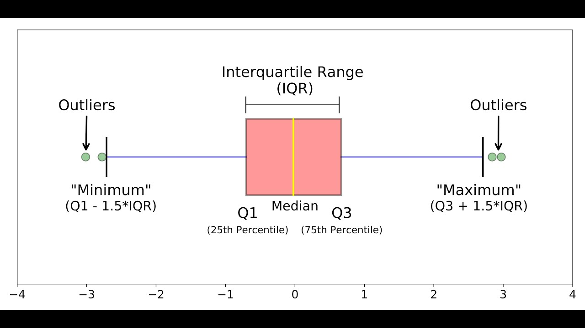

*[Source](https://i.ytimg.com/vi/BE8CVGJuftI/maxresdefault.jpg)*

We will import data from a file that contains the same information as **geneexp** but in a slightly different format (that we will explain in more details in a next section):

```{r, echo=T, eval=T, message=F, warning=F}
geneexp2 <- read_csv("DataViz_source_files-main/files/expression_20genes_long.csv")
```

In our first boxplot, one box corresponds to one sample:

```{r}
ggplot(geneexp2, aes(x=sample, y=expression)) + 
  geom_boxplot()
```

We can split boxes by **DE**, the same way as is done for barplots, by mapping **fill** or **color** to the variable:

```{r}
ggplot(geneexp2, aes(x=sample, y=expression, fill=DE)) + 
  geom_boxplot()
```

It is easy to change the box to a violin plot:

```{r}
ggplot(geneexp2, aes(x=sample, y=expression, fill=DE)) + 
  geom_violin()
```

Violin plots also aim to visualize data distribution. While boxplots can only show summary statistics / quantiles, violin plots also show the density of each variable.

## Text fine-tuning

Controlling the **font size and style** of the different components of the graph (axis text, title, legend, etc.) is essential for the understanding and impact of the figure.

Text size and style in ggplot2 graphs can be modified using the **theme()** function. 
While very powerful, it can take some time to get used to the structure.

We will illustrate how to make some changes using **theme()** layer on our first scatter plot.

* Change **overall** font size:

```{r}
ggplot(data=geneexp, mapping=aes(x=sample1, y=sample2)) + 
  geom_point() +
  ggtitle("scatter plot") +
  theme(text = element_text(size = 20))
```

* Change font size of **axis text**:

```{r}
ggplot(data=geneexp, mapping=aes(x=sample1, y=sample2)) + 
  geom_point() +
  ggtitle("scatter plot") +
  theme(axis.text = element_text(size = 20))
```

* Change font size of **axis titles**:

```{r}
ggplot(data=geneexp, mapping=aes(x=sample1, y=sample2)) + 
  geom_point() +
  ggtitle("scatter plot") +
  theme(axis.title = element_text(size = 20))
```

* **Remove axis titles** (e.g. below: removing x-axis title):

```{r}
ggplot(data=geneexp, mapping=aes(x=sample1, y=sample2)) + 
  geom_point() +
  ggtitle("scatter plot") +
  theme(axis.title.x = element_blank())
```

* **Shift** the graph title to the right (it is by default centered to the left):

```{r}
ggplot(data=geneexp, mapping=aes(x=sample1, y=sample2)) + 
  geom_point() +
  ggtitle("scatter plot") +
  theme(plot.title = element_text(hjust = 0.5))
```

* Change font size of the **graph title**:

```{r}
ggplot(data=geneexp, mapping=aes(x=sample1, y=sample2)) + 
  geom_point() +
  ggtitle("scatter plot") +
  theme(plot.title = element_text(size = 20, hjust = 0.5))
```

* Change the **color of the title**, and make it **bold**:

```{r}
ggplot(data=geneexp, mapping=aes(x=sample1, y=sample2)) + 
  geom_point() +
  ggtitle("scatter plot") +
  theme(plot.title = element_text(size = 20, hjust = 0.5, face = "bold", colour = "blue"))
```

* You can also use theme() to **rotate the x-axis label** of plots, for example:

```{r}
ggplot(data=geneexp, mapping=aes(x=sample1, y=sample2)) + 
  geom_point() +
  ggtitle("scatter plot") +
  theme(axis.text.x = element_text(angle=90))
```

* As a last examples, let's see how we can control the **plot's legend**:

**Colored background:**

```{r}
ggplot(data=geneexp, mapping=aes(x=sample1, y=sample2, color=DE)) + 
  geom_point() +
  theme(legend.background = element_rect(fill="yellow"))
```

**Decrease or increase the space between the legend box and the plot:**

```{r}
ggplot(data=geneexp, mapping=aes(x=sample1, y=sample2, color=DE)) + 
  geom_point() +
  theme(legend.box.spacing = unit(3, "cm")) # default is 0.4cm
```

Remove the **key background**:

```{r}
ggplot(data=geneexp, mapping=aes(x=sample1, y=sample2, color=DE)) + 
  geom_point() +
  theme(legend.key = element_blank())
```

Graphical summary of the different **theme elements**:


[source](https://henrywang.nl/ggplot2-theme-elements-demonstration/)

To learn more, check:

* [complete guide on how to modify the ggplot2 theme](https://ggplot2tor.com/theme/).
* [ggplot2 theme elements demonstration (source of above image)](https://henrywang.nl/ggplot2-theme-elements-demonstration/)
* [ggplot2 styling](https://tidyverse.org/blog/2025/10/ggplot2-styling/)


## Colors

This section shows how to change colors and fetch color scales/palettes in ggplot2 (and more generally, in R).

### All R colors

The easiest way is to fetch colors [by their names](https://r-graph-gallery.com/42-colors-names.html).

There are 657 color names available for you to pick! You can check them by querying the following in the console:

```{r, eval=F}
colors()
```

ggplot2 provides a color scale by default. Many different **palettes** are available to change the default scale.

### Base R palettes

Base R provides built-in palettes, that can be leveraged in ggplot. For example:

* **rainbow()**
* **heat.colors()**
* **terrain.colors()**
* **topo.colors()**
* **cm.colors()**

All of the above are functions that take one parameter **n** that is, the number of colors needed. The output is a vector of **hex color codes**, for example:

```{r}
rainbow(5)
rainbow(10)
```

We can set them as **values** parameter in the **scale_fill_manual()** or **scale_color_manual()** layers:

```{r}
ggplot(data=gtf, mapping=aes(x=chr, fill=gene_type)) + 
  geom_bar(position="dodge") +
  scale_fill_manual(values=rainbow(5))

ggplot(data=gtf, mapping=aes(x=chr, fill=gene_type)) + 
  geom_bar(position="dodge") +
  scale_fill_manual(values=terrain.colors(5))
```


### RColorBrewer

You can easily pick palettes from the [**RColorBrewer** package](https://r-graph-gallery.com/38-rcolorbrewers-palettes.html), that is included in ggplot2.

Available palettes are shown below:

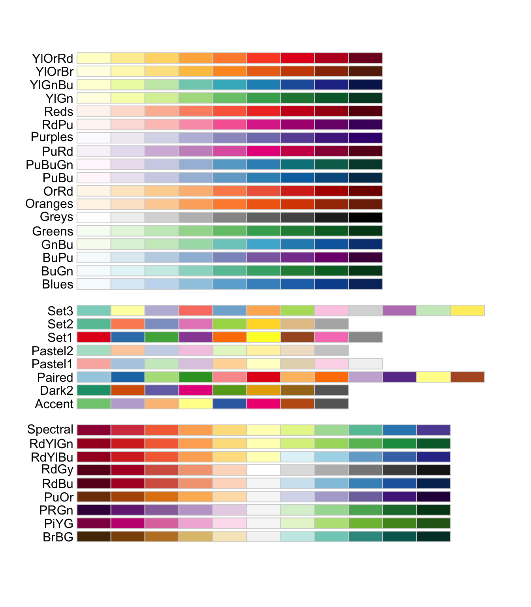

You can check which palettes are **colorblind-friendly** the following way:

```{r, fig.height=10}
library(RColorBrewer)
display.brewer.all(colorblindFriendly = TRUE)
```

We can easily take advantage of the RColorBrewer's palettes in ggplot2 with :

* **scale_color_brewer()** layer (if you mapped variables with **color** in **aes()**)
* **scale_fill_brewer()** layer (if you mapped variables with **fill** in **aes()**)

```{r}
ggplot(data=gtf, mapping=aes(x=chr, fill=gene_type)) + 
  geom_bar(position="dodge") +
  scale_fill_brewer()
```

By default, the palette used is "Blues".

How does that look using "Dark2" palette?

```{r}
ggplot(data=gtf, mapping=aes(x=chr, fill=gene_type)) + 
  geom_bar(position="dodge") +
  scale_fill_brewer(palette="Dark2")
```

### ggsci

Package [**{ggsci}**](https://cran.r-project.org/web/packages/ggsci/vignettes/ggsci.html) contains a collection of **pre-made color palettes inspired by colors used in scientific journals** (and also by Science Fiction movies and series!).

Example of palettes from {ggsci}:

* **scale_color_npg()** and **scale_fill_npg()** (*Nature Publishing Group*)
* **scale_color_aaas()** and **scale_fill_aaas()**: (*American Association for the Advancement of Science*)
* **scale_color_lancet()** and **scale_fill_lancet()** (*Lancet*)
* **scale_color_igv()** and **scale_fill_igv()** (*Integrative Genome Viewer*)
* **scale_color_gsea()** and **scale_fill_gsea()** (*Gene Set Enrichment Analysis*)
* **scale_color_startrek()** and **scale_fill_startrek()**
* **scale_color_simpsons()** and **scale_fill_simpsons()**

Note that some palettes are for continuous variables (e.g. gsea), and some for discrete variables (e.g. npg).

Example of scales for discrete data:

```{r}
# do not forget to load the package!
library(ggsci)

ggplot(data=gtf, mapping=aes(x=chr, fill=gene_type)) + 
  geom_bar(position="dodge") +
  ggtitle("scale_fill_ngp", subtitle = "Nature Publishing Group") +
  scale_fill_npg()
```

```{r}
ggplot(data=gtf, mapping=aes(x=chr, fill=gene_type)) + 
  geom_bar(position="dodge") +
  ggtitle("scale_fill_aaas", subtitle = "American Association for the Advancement of Science") +
  scale_fill_aaas()
```

Example of a scale for continuous data:

```{r}
 ggplot(data=geneexp, mapping=aes(x=sample1, y=sample2, color=sample1)) + 
  geom_point() + scale_color_gsea()

```

## Faceting

ggplot2 provides **facet** functions in R, that are used to **split the plot into smaller plots**, according to a given variable.

Let's start again from the **gtf** object.

You can run the following command if you do not have the data loaded in your environment:

```{r}
gtf <- read_csv("DataViz_source_files-main/files/gencode.v44.annotation.csv")
```

We previously produced a barplot out of this data. However, there is one variable that we did not consider for the visualization: **strand**.

Using the faceting function **facet_wrap**, one can easily split that barplot into 2 plots: one will represent the **+** strand, one will represent the **-** strand.

```{r, fig.width=15}
ggplot(data=gtf, mapping=aes(x=chr, fill=gene_type)) + 
  geom_bar(position="dodge") + 
  facet_wrap(~strand)
```


If you want to organize plots vertically, you can set **dir="v"**:

```{r, fig.width=15}
ggplot(data=gtf, mapping=aes(x=chr, fill=gene_type)) + 
  geom_bar(position="dodge") + 
  facet_wrap(~strand, dir="v")
```

You can also split/facet the plots using a second variable, for example:

```{r, fig.width=15, fig.height=15}
ggplot(data=gtf, mapping=aes(x=chr, color=chr)) + 
  geom_bar(position="dodge") + 
  facet_wrap(gene_type~strand)
```

By default, scales are common in all plots. You may want to change this to "free scales" for more readability: it will set the scales per sub-plot.

```{r, fig.width=15, fig.height=15}
ggplot(data=gtf, mapping=aes(x=chr, color=chr)) + 
  geom_bar(position="dodge") + 
  facet_wrap(gene_type~strand, scales = "free")
```

## Exercise 3

The objective of this exercise is give you the opportunity to practice some of the fine-tuning we have just learned.

For this exercise, we will use the [*diamonds* dataset](https://ggplot2.tidyverse.org/reference/diamonds.html)

**diamonds** is a built-in data set that is automatically loaded with {ggplot2}. 

The dataset containing the prices and other attributes of almost 54,000 diamonds.

If {ggplot2} is loaded, you can readily use **diamonds**:

```{r}
diamonds
```

1. Create a scatter plot of **carat** (x-axis) vs **price** (y-axis), with colors mapped to the **cut**.

<details>
<summary>
correction
</summary>

```{r}
ggplot(data=diamonds, mapping=aes(x=carat, y=price, color=cut)) +
  geom_point()
```

</details>

<br>

2. Facet / split the plot per **clarity** (a column in **diamonds**).

<details>
<summary>
correction
</summary>

```{r}
ggplot(data=diamonds, mapping=aes(x=carat, y=price, color=cut)) +
  geom_point() +
  facet_wrap(~clarity)
```

</details>

<br>

3. Change the defaut theme  (to theme_bw(), theme_minimal(), for example) and increase the base text size, and add a title to the overall plot.

<details>
<summary>
correction
</summary>

```{r}
ggplot(data=diamonds, mapping=aes(x=carat, y=price, color=cut)) +
  geom_point() +
  facet_wrap(~clarity) +
  theme_minimal(base_size = 15) +
  ggtitle("Diamonds carat, price, cut and clarity")
```

</details>

<br>

4. Change the color palette to the one of your choice. You can pick one from RColorBrewer, for example.

<details>
<summary>
correction
</summary>

```{r}
ggplot(data=diamonds, mapping=aes(x=carat, y=price, color=cut)) +
  geom_point() +
  facet_wrap(~clarity) +
  theme_minimal(base_size = 15) +
  ggtitle("Diamonds carat, price, cut and clarity") +
  scale_color_brewer(palette="Dark2")
```

</details>

<br>

5. Play with the **theme()** function. For example:
* Rotate the x-axis labels to 90 degrees. 
* Make the individual titles larger bold (this is done with **strip.text** parameter).

<details>
<summary>
correction
</summary>

```{r, fig.height=12, fig.width=10}
ggplot(data=diamonds, mapping=aes(x=carat, y=price, color=cut)) +
  geom_point() +
  facet_wrap(~clarity) +
  theme_minimal(base_size = 15, base_family = "Padauk") +
  ggtitle("Diamonds carat, price, cut and clarity") +
  scale_color_brewer(palette="Dark2") +
  theme(axis.text.x = element_text(angle=90), strip.text = element_text(size = 16, face = "bold"))
```

</details>

<br>

<!--chapter:end:ggplot2.Rmd-->

# Data filtering and wrangling

In this section, we will learn to use a few functions to filter, select and re-organize a data object.

## filter()

**filter()** will filter (keep or remove) **rows**.

We can start from **geneexp** object, and filter only down-regulated genes using the **filter()** function of **{dplyr}**.

If you need to import the data again, run the following command:

```{r, eval=FALSE}
geneexp <- read_csv("DataViz_source_files-main/files/expression_20genes.csv")
```

```{r}
filter(geneexp, DE=="Down")
```

**==** is a **logical operator** that represents equality. It means that filter will return **rows in geneexp that are exactly equal to "Down"**.

Logical operators:

| Operator  | Description   |
|:--------: |:-------------:|
|     <     | less than    |
|     <=    | less than or equal to   |
|     >     | greater than  |
|     >=    | greater than or equal to|
|     ==    | exactly equal to   |
|     !=    | not equal to |
|    !x     | not x |
|    x \| y  | x OR y |
|    x & y  | x AND y |

We can have several conditions.

For example, we may want to extract only rows that have either **Up** OR **Down** in **DE**:

```{r}
filter(geneexp, DE=="Down" | DE=="Up")
```

Here, we introduce another operator, **|**, that means **OR**: rows are kept if values are either **Down** OR **Up** in **DE** column.

A good practice is to assign the filtered output to a new object, for example:

```{r}
geneexp_filt <- filter(geneexp, DE=="Down" | DE=="Up")
```

## select()

**select()** will select (keep or remove) **columns** from a data frame.

Select only columns **Gene** and **DE** from **geneexp**:

```{r}
select(geneexp, Gene, DE)
```

Remove column **DE**:

```{r}
select(geneexp, -DE)
```

Again, a good practice is to save that subset into a new object:

```{r}
geneexp_selected <- select(geneexp, Gene, DE)
```

## rename()

You can rename a column using the **rename()** function.

For example, we can rename column **Gene** to **Symbol**, the following way:

```{r}
rename(geneexp, Symbol=Gene)
```

The first argument is the data, then comes the column(s) to rename in the format: *new_name=old_name*.


## Exercise 4

In this short exercise, you will practice using the functions for data manipulation we just learned.

We will start from **gtf**.

If **gtf** it is no longer in your environment, load it with:

```{r, eval=F}
gtf <- read_csv("DataViz_source_files-main/files/gencode.v44.annotation.csv")
```

1. Rename column **chr** as **Chromosome**. Assign to a new object.

<details>
<summary>
correction
</summary>

```{r}
gtf2 <- rename(gtf, chromosome=chr)
```

</details>

<br>
2. Keep rows with **"+"** strand on chromosome **"chr4"**. Assign this filtered data to a new object.

<details>
<summary>
correction
</summary>

```{r}
gtf3 <- filter(gtf2, strand=="+" & chromosome=="chr4")
```

</details>

<br>

3. Remove columns **strand** and **gene_type**.

<details>
<summary>
correction
</summary>

```{r}
gtf4 <- select(gtf3, -strand, -gene_type)
```

</details>

<br>


<!--chapter:end:data_wrangling.Rmd-->

# More ggplots

## Histograms and density plots

Histograms and density plots are both visualizations of the distribution of quantitative variables.

### Histogram

We will use a previous object to create a histogram, with **geom_histogram**. You can get it back with:

```{r}
rnaseq2 <- read_csv("DataViz_source_files-main/files/GSE150029_rnaseq_log2_long.csv")
```

```{r}
ggplot(rnaseq2, aes(x=log2_counts)) + 
  geom_histogram()
```

Split the histogram per sample:

```{r}
ggplot(rnaseq2, aes(x=log2_counts, color=sample)) + 
  geom_histogram() 
```

Set position to "identity": histograms will not be "on top of each other" but on a comparative scale:

```{r}
ggplot(rnaseq2, aes(x=log2_counts, color=sample)) + 
  geom_histogram(position="identity")
```

Set alpha (transparency to 0.2):

```{r}
ggplot(rnaseq2, aes(x=log2_counts, color=sample)) + 
  geom_histogram(position="identity", alpha=0.2)
```

Express as density instead of counts:

```{r}
ggplot(rnaseq2, aes(x=log2_counts, color=sample)) + 
  geom_histogram(aes(y=after_stat(density)), position="identity", alpha=0.2) +
  theme_classic()
```


### Density plot

It is similar to create a density plot, using **geom_density**:


```{r}
ggplot(rnaseq2, aes(x=log2_counts, color=sample)) + 
  geom_density(alpha=0.2) +
  theme_classic()
```

You can use fill instead:

```{r}
ggplot(rnaseq2, aes(x=log2_counts, fill=sample)) + 
  geom_density(alpha=0.2) +
  theme_classic()
```

### Histogram + density

As we combined geom_boxplot and geom_violin in a previous exercise, we can also combine geom_histogram and geom_density:

```{r}
ggplot(rnaseq2, aes(x=log2_counts, color=sample)) + 
  geom_histogram(aes(y=after_stat(density)), position="identity", alpha=0.2) +
  geom_density(alpha=0.2) +
  theme_classic()
```


## Pie chart

Pie charts are used to visualize how much each categories contribute to a whole, with each "slice" representing one category.

We will plot a pie chart representing the number of genes from **gtf** found in each chromosome.

Prepare data so as to obtain counts (that is more advanced dplyr manipulation - we will not go through details):

```{r}
gtf_count_chr <- gtf %>%
  group_by(chr) %>% # group by allows to make the next calculations by the group specified
  summarise(counts=n())
```

The **coord_polar()** is needed here: pie plots are stacked barplots in polar coordinates.

```{r}
ggplot(data=gtf_count_chr, mapping=aes(x="", y=counts, fill=chr)) + 
  geom_bar(stat="identity") +
  coord_polar("y", start=0)
```

```{r}
ggplot(data=gtf_count_chr, mapping=aes(x="", y=counts, fill=chr)) + 
  geom_bar(stat="identity") +
  coord_polar("y", start=0) +
  theme_void()
```

Change the color scale:

```{r}
ggplot(data=gtf_count_chr, mapping=aes(x="", y=counts, fill=chr)) + 
  geom_bar(stat="identity") +
  coord_polar("y", start=0) +
  scale_fill_brewer(palette="Paired") +
  theme_void()
```

Here is a [nice page](https://genchanghsu.github.io/ggGallery/posts/2021-06-18-post-3-pie-charts-with-ggplot/) about more pie plot customization.

## Marginal plots

Function [**ggMarginal**](https://www.rdocumentation.org/packages/ggExtra/versions/0.10.1/topics/ggMarginal) from package {ggExtra} allows to easily add histograms, boxplots or density plots to the margins of a scatter plot.

```{r}
library(ggExtra)

# Save the classic plot to an object.
p <- ggplot(data=geneexp, mapping=aes(x=sample1, y=sample2)) +
      geom_point()
```

```{r}
# add marginal histogram
ggMarginal(p, type="histogram")
```

```{r}
# add marginal density
ggMarginal(p, type="density")
```

```{r}
# add marginal boxplot
ggMarginal(p, type="boxplot")
```

The **mapping of variables** (for example, using **color** or **fill**) can also be **inherited** by the marginal plots.

```{r}
# add mapping of points to "DE" column :
p <- ggplot(data=geneexp, mapping=aes(x=sample1, y=sample2, color=DE)) +
  geom_point()

# tell ggMarginal to color / split the boxplot according to variable mapped in color/colour
ggMarginal(p, type="boxplot", groupColour = TRUE)
```

Let's add more features that we have learned in this workshop:

```{r, fig.height=12, fig.width=10}
# add mapping of points to "DE" column :
p <- ggplot(data=geneexp, mapping=aes(x=sample1, y=sample2, color=DE)) +
  geom_point() +
  theme_minimal(base_size = 16) +
  geom_rug(alpha=0.4, sides = "tr") +
  geom_density_2d(alpha=0.2, colour = "pink") +
  ggtitle("Example of ggMarginal") +
  theme(legend.position="bottom", plot.title = element_text(hjust = 0.5))

# tell ggMarginal to color / split the boxplot according to variable mapped in color/colour
ggMarginal(p, type="boxplot", groupColour = TRUE)
```


<!--chapter:end:more_ggplots.Rmd-->

# Exercises to do at home

The objective of the following exercises is to help you practice what was learned so far during the workshop. You can practice at home and reach out if you have any issue.
<br>

Exercise 5: barplot
<br>
Exercise 6: scatter plot
<br>
Exercise 7: boxplot
<br>

## Exercise 5: barplot

1. Import **DataViz_source_files-main/files/population_age_group_per_sex_long_format.csv** into an object called **pop_age**.

<details>
<summary>
correction
</summary>

```{r}
pop_age <- read_csv("DataViz_source_files-main/files/population_age_group_per_sex_long_format.csv")
```

</details>

<br>

2. Create a barplot that shows the population count per **Year**:

<details>
<summary>
correction
</summary>

```{r}
ggplot(data=pop_age, mapping=aes(x=Year, y=Population)) + 
  geom_bar(stat="identity")
```

</details>

<br>

3. Split boxes per Sex (**in the same plot**: do not split into different plots):


<details>
<summary>
correction
</summary>

```{r}
ggplot(data=pop_age, mapping=aes(x=Year, y=Population, fill=Sex)) + 
  geom_bar(stat="identity")
```

</details>

<br>

4. Keep only data that corresponds to "Spain". You can do this in 2 steps: filter first, then plot.

  
<details>
<summary>
correction
</summary>

```{r}
pop_age_spain <- filter(pop_age, Country=="Spain")
ggplot(data=pop_age_spain, mapping=aes(x=Year, y=Population, fill=Sex)) + 
  geom_bar(stat="identity")
```


</details>

<br>

5. Display the bars next to each other:

<details>
<summary>
correction
</summary>

```{r}
ggplot(data=pop_age_spain, mapping=aes(x=Year, y=Population, fill=Sex)) + 
  geom_bar(stat="identity", position="dodge")
```

</details>

<br>


6. Change default colors using **scale_fill_manual()** layer.

The structure is not easy to remember: take a peek at the answer!

  
<details>
<summary>
correction
</summary>

```{r}
ggplot(data=pop_age_spain, mapping=aes(x=Year, y=Population, fill=Sex)) + 
  geom_bar(stat="identity", position="dodge") + 
  scale_fill_manual(values=c(Female="darkgreen", Male="red"))
```

</details>

<br>

7. Add a title, change the theme / background:

<details>
<summary>
correction
</summary>

```{r}
ggplot(data=pop_age_spain, mapping=aes(x=Year, y=Population, fill=Sex)) +
  geom_bar(stat="identity", position="dodge") + 
  scale_fill_manual(values=c("darkgreen", "red")) + 
  ggtitle("Spanish population from 1950 to 2021 per sex") + 
  theme_minimal()
```

</details>

<br>
8. Create one plot per **Age group** using **facet_wrap()**

<details>
<summary>
correction
</summary>

```{r}
ggplot(data=pop_age_spain, mapping=aes(x=Year, y=Population, fill=Sex)) +
  geom_bar(stat="identity", position="dodge") + 
  scale_fill_manual(values=c("darkgreen", "red")) + 
  ggtitle("Spanish population from 1950 to 2021 per sex") + 
  theme_minimal() +
  facet_wrap(~Age_group)
```

</details>
<br>

9. Save to a PDF file: Export -> Save as PDF. Note: when saving to PDF format, you cannot manualy drag the plot to get the size and proportion you want, but you can **Preview** before saving it.

If you prefer, you can save the file using **ggsave()** (or you can do both!).

<details>
<summary>
correction
</summary>

```{r}
# first, save to an object
plot_age <- ggplot(data=pop_age_spain, mapping=aes(x=Year, y=Population, fill=Sex)) +
  geom_bar(stat="identity", position="dodge") + 
  scale_fill_manual(values=c("darkgreen", "red")) + 
  ggtitle("Spanish population from 1950 to 2021 per sex") + 
  theme_minimal() +
  facet_wrap(~Age_group)

# save file
ggsave(filename="population_age_sex_Spain.pdf", plot=plot_age, device = "pdf", units = "in", width = 10, height = 8)
```

</details>

<br>

10. Save your filtered data as a **.csv** file: have a look at the **write_csv()** function from {readr}:

<details>
<summary>
correction
</summary>

```{r}
write_csv(pop_age_spain, "subset_spain.csv")
```

</details>

## Exercise 6: scatter plot

1. Import **DataViz_source_files-main/files/GSE150029_rnaseq_log2.csv** into an object called **rnaseq**.

<details>
<summary>
correction
</summary>

```{r}
rnaseq <- read_csv("DataViz_source_files-main/files/GSE150029_rnaseq_log2.csv")
```

</details>
<br>

2. Create a scatter plot of sample CTRL (x-axis) versus sample EZH (y-axis).

<details>
<summary>
correction
</summary>

```{r}
ggplot(data=rnaseq, mapping=aes(x=CTRL, y=EZH)) +
  geom_point()
```

</details>

<br>
3. Map/color the points to the **gene_biotype**

<details>
<summary>
correction
</summary>

```{r, fig.width=16}
ggplot(data=rnaseq, mapping=aes(x=CTRL, y=EZH, color=gene_biotype)) +
  geom_point()
```

</details>

<br>
3. Not very readable! Filter and plot only data corresponding to **either lincRNA OR miRNA**.

<details>
<summary>
correction
</summary>

```{r}
rnaseq_linc_mirna_filter1 <- filter(rnaseq, (gene_biotype=="lincRNA" | gene_biotype=="miRNA"))

ggplot(data=rnaseq_linc_mirna_filter1, mapping=aes(x=CTRL, y=EZH, color=gene_biotype)) +
  geom_point()
```

</details>

<br>
4. Keep only those lincRNAs and miRNAs expressed in CTRL **at least 1.5 times more than in EZH**.

<details>
<summary>
correction
</summary>

```{r}
rnaseq_linc_mirna_filter2 <- filter(rnaseq, (gene_biotype=="lincRNA" | gene_biotype=="miRNA") & CTRL > 1.5*EZH)

ggplot(data=rnaseq_linc_mirna_filter2, mapping=aes(x=CTRL, y=EZH, color=gene_biotype)) +
  geom_point()
```

</details>

5. Add a title to the plot, and make it **bold** (see **theme()** section of the course)

<details>
<summary>
correction
</summary>

```{r}
ggplot(data=rnaseq_linc_mirna_filter2, mapping=aes(x=CTRL, y=EZH, color=gene_biotype)) +
  geom_point() +
  ggtitle("lincRNA and miRNA") +
  theme(plot.title = element_text(face = "bold"))
```

</details>
<br>

<details>
<summary>
NOTE: If you want to label only one (or few) point(s), click here.
</summary>

First, filter the data frame:
```{r}
SNHG8 <- filter(rnaseq, gene_name=="SNHG8")
```

Then, add it to geom_text:

```{r}
ggplot(data=rnaseq_linc_mirna_filter2, mapping=aes(x=CTRL, y=EZH, color=gene_biotype)) +
  geom_point() +
  ggtitle("lincRNA and miRNA") +
  theme(plot.title = element_text(face = "bold")) +
  geom_text(data=SNHG8, label="SNHG8", show.legend = FALSE)
```

</details>
<br>


## Exercise 7: boxplot

1. Read in **DataViz_source_files-main/files/GSE150029_rnaseq_log2_long.csv** into a new object called **rnaseq2**.

<details>
<summary>
correction
</summary>

```{r}
rnaseq2 <- read_csv("DataViz_source_files-main/files/GSE150029_rnaseq_log2_long.csv")
```

</details>

<br>

2. Create a boxplot with expression/count distribution per sample.

<details>
<summary>
correction
</summary>

```{r}
ggplot(data=rnaseq2, mapping=aes(x=sample, y=log2_counts)) + 
  geom_boxplot()
```

</details>

<br>

3. Split the boxes per **gene_biotype**.

<details>
<summary>
correction
</summary>

```{r, fig.width=18, fig.height=9}
ggplot(data=rnaseq2, mapping=aes(x=sample, y=log2_counts, fill=gene_biotype)) + 
  geom_boxplot()
```

</details>
<br>

4. Keep only *protein_coding* and *lincRNA* biotypes (you can save the filtered data into a new object) and re-do the same plot as in 3.

<details>
<summary>
correction
</summary>

```{r}
rnaseq2_filtered <- filter(rnaseq2, gene_biotype=="protein_coding" | gene_biotype=="lincRNA")

ggplot(data=rnaseq2_filtered, mapping=aes(x=sample, y=log2_counts, fill=gene_biotype)) + 
  geom_boxplot()
```

</details>

<br>

5. Add a **geom_violin()** layer. Set **alpha=0.3** in geom_violin. What is the alpha parameter?

<details>
<summary>
correction
</summary>

```{r}
ggplot(data=rnaseq2_filtered, mapping=aes(x=sample, y=log2_counts, fill=gene_biotype)) + 
  geom_boxplot() +
  geom_violin(alpha=0.3)

# if boxplot and violin plots are misaligned, you can play with the position parameter in geom_violin, such as:
# geom_violin(position=position_dodge(0.7))
```

</details>

<br>

6. Look at the help page of **geom_boxplot()** and change the following parameters:

* Set outlier color to red
* Set outlier shape as triangles

<details>
<summary>
correction
</summary>

```{r}
ggplot(data=rnaseq2_filtered, mapping=aes(x=sample, y=log2_counts, fill=gene_biotype)) + 
  geom_boxplot(outlier.colour = "red", outlier.shape = "triangle")
```

</details>


<!--chapter:end:more_exercises.Rmd-->

# Interactive plots with {plotly}

**{plotly}** is a package that makes interactive graphs.

There are many applications to plotly, but a simple one is to convert a plot created by ggplot into an interactive version.

First we can install **plotly** (bottom-right panel -> Packages -> Install).

And then we load the package: **tick** the package in the list.

<br>

Let's read again one of our first data file:

```{r, echo=T, eval=F}
geneexp <- read_csv("DataViz_source_files-main/files/expression_20genes.csv")
```

We can first save the "ggplot" as an object **myplot**:

```{r}
myplot <- ggplot(data=geneexp, mapping=aes(x=sample1, y=sample2, label=Gene, color=DE)) + 
  geom_point()
```

And then input that object into the **ggplotly()** function. 

```{r, echo=T, eval=F}
ggplotly(p=myplot)
```

The interactive plot should appear in the **Viewer** tab (bottom-right panel). Not that you can zoom into the plot!

Customize what appears in the tooltip box. For example, here, we only show the gene label information:

```{r, echo=T, eval=F}
ggplotly(p=myplot, tooltip="label")
```

It also works for different types of plots: for example, barplots.

```{r}
mybarplot <- ggplot(data=geneexp, mapping=aes(x=DE)) + 
  geom_bar()
```

```{r, echo=T, eval=F}
ggplotly(p=mybarplot)
```

You can add ggplot2 layers / components:

```{r}
mybarplot <- ggplot(data=geneexp, mapping=aes(x=DE)) + 
  geom_bar() +
  ggtitle(label="barplot in ggplotly") +
  theme_bw()
```

```{r, echo=T, eval=F}
ggplotly(p=mybarplot)
```

<!--chapter:end:plotly.Rmd-->

# More advanced data manipulation

## The pipe operator

The **tidyverse** provides a function **%>%** which **pipes** the output of one function as the input of the next function. 

This way, different functions from the tidyverse can be linked together into a clean piece of code.

If we want to produce a one-liner out of the 3 lines of code of the previous exercise, we can do it the following way:

```{r}
gtf_final <- rename(gtf, chromosome=chr) %>%
  filter(strand=="+" & chromosome=="chr4") %>%
  select(gene_symbol, gene_type)
```

*Note that, in filter and select, you do not need to specify the first parameter (the data), as it is automatically looking for the output of the previous one!*

If you want to learn more about the **pipe**, you can for example refer to [that page](https://style.tidyverse.org/pipes.html).

Note that we can also link the data manipulation output to ggplot: the **output of the last command will then be used as an input to ggplot**:

```{r}
rename(gtf, chromosome=chr) %>%
  filter(strand=="+" & chromosome=="chr4") %>%
  select(gene_symbol, gene_type) %>% 
  ggplot(aes(x=gene_type)) + geom_bar()
```


## From wide to long format

The wide format is what you would typically have in a table with measurements, such as genes in rows and samples in columns.

However, we have seen that ggplot2 sometimes requires data to be **converted to a long format**.

In a long format, **one row corresponds to one observation/measurement, with all information associated to it**.

**{tidyr}** provides **pivot_longer()** to convert wide to long format, and **pivot_wider()** to convert a long to a wide format.

Our object geneexp is in a wide format. Two columns contain values of expression:

```{r, echo=F}
head(geneexp, 5)
```

In order to convert to a long format we will create:

* One column that contains the sample names
* One column that contains the expression values

```{r}
pivot_longer(geneexp, cols=c("sample1", "sample2"))
```

We can specify the names of the new columns as we create them:

```{r}
pivot_longer(geneexp, cols=c("sample1", "sample2"), names_to = "samples", values_to = "expression")
```


## Exercise 8

Let's do a small exercise to practice this conversion.

1. Read in file **DataViz_source_files-main/files/stats_countries_barcelona_2013-2023.csv**

<details>
<summary>
correction
</summary>

```{r}
stats_countries <- read_csv("DataViz_source_files-main/files/stats_countries_barcelona_2013-2023.csv")
```

</details>

<br>
2. Columns 2013 to 2022 contain **observations**. Convert this wide format into a long format. Save into a new object.

<details>
<summary>
correction
</summary>

```{r, eval=TRUE}
# Option 1: list all columns
stats_countries_long <- pivot_longer(stats_countries, 
                                     cols=c("2013", "2014", "2015", "2016", "2017", "2018", "2019", "2020", "2021", "2022", "2023"),
                                     values_to = "Population",
                                     names_to = "Years")

# Option 2: select columns that start with "20"
stats_countries_long <- pivot_longer(stats_countries, 
                                     cols=starts_with("20"),
                                     values_to = "Population",
                                     names_to = "Years")

# Option 3: select all numeric columns
stats_countries_long <- pivot_longer(stats_countries, 
                                     cols=where(is.numeric),
                                     values_to = "Population",
                                     names_to = "Years")
```

</details>

<br>
3. Do the 3 following tasks linked by a **%>%** (pipe):

* Keep only rows that 
  * match "America" in column "Continent"
  * have a population >= 50 (column "Population")
* Remove column **Continent**.
* Produce a barplot with "Years" in the x-axis, Population in the y-axis, and split by Country.

<details>
<summary>
correction
</summary>

```{r, fig.width=15}
stats_countries_long_filtered <- filter(stats_countries_long, Continent=="America" & Population >= 50) %>%
  select(-Continent)

ggplot(data=stats_countries_long_filtered, mapping=aes(x=Years, y=Population, fill=Country)) +
  geom_bar(stat = "identity", position = "dodge")
```

</details>

4. Customize your plot! Remember what we have done so far... You can, for example:

* Add a title (**ggtitle()**)
* Change the overall theme (e.g. **theme_bw()**, **theme_minimal()**) and / or play with graphical parameters (see section on **theme()** function)
* Facet the graph (**facet_wrap()**)
* ... what else?...

<details>
<summary>
One way out of hundreds of ways to show your data!
</summary>

```{r, fig.width=15, fig.height=10}
ggplot(data=stats_countries_long_filtered, mapping=aes(x=Years, y=Population, fill=Country)) +
  geom_bar(stat = "identity", position = "dodge") + 
  theme_minimal(base_size = 14) + 
  ggtitle("American population in Barcelona from 2013 to 2023") + 
  theme(axis.text.x = element_text(angle=90), plot.title = element_text(size = 16, hjust = 0.5, face = "bold")) +
  facet_wrap(~Country)
```

If you have tried to change the color scale, you may have noticed that none are large enough for this data (we need 22 colors). One way to tackle this problem is to combine color palettes (e.g. from RColorBrewer) prior to plotting.

```{r, fig.width=15, fig.height=10}
# create a vector of 22 colors from RColorBrewer
my22colors <- c(brewer.pal(n=11, name="Paired"), brewer.pal(n=11, name="Set3"))

# feed the colors to "scale_fill_manual"
ggplot(data=stats_countries_long_filtered, mapping=aes(x=Years, y=Population, fill=Country)) +
  geom_bar(stat = "identity", position = "dodge") + 
  theme_minimal(base_size = 14) + 
  scale_fill_manual(values=my22colors) +
  ggtitle("American population in Barcelona from 2013 to 2023") + 
  theme(axis.text.x = element_text(angle=90), plot.title = element_text(size = 16, hjust = 0.5, face = "bold")) +
  facet_wrap(~Country)
```

</details>

<!--chapter:end:data_wrangling_advanced.Rmd-->

# Heatmaps with {pheatmap}

We will introduce package **{pheatmap}** to produce heatmaps.

First we can install **pheatmap** (bottom-right panel -> Packages -> Install).

And then we load the package: **tick** the package in the list, or load it from the console:

<br>
```{r, echo=T, fig.height=15, fig.width=10}
library(pheatmap)
```

**pheatmap** is not from the tidyverse package, and does not follow the same structure. It does not work with layers, but with multiple parameters inside a same function.

Let's read the following data file, and convert it to matrix (that is the input format for pheatmap):

```{r, echo=T, eval=T}
expr_heatmap <- read_csv("DataViz_source_files-main/files/GSE150029_rnaseq_for_heatmap.csv") %>%
  column_to_rownames(var = "gene_name") %>%
  as.matrix()
```

You can then simply plot the heatmap, giving the matrix as an input:

```{r, eval=F, fig.height=7, fig.width=6}
pheatmap(expr_heatmap)
```

Control what is clusters: rows, columns, both, or none:

```{r, eval=T, fig.height=7, fig.width=6}
pheatmap(expr_heatmap, cluster_cols=FALSE, cluster_rows=TRUE)
```

Show or hide row names:

```{r, eval=T, fig.height=7, fig.width=6}
pheatmap(expr_heatmap, show_rownames = F)
```

Change the color scale (**rainbow()** and **heat.colors()** are available from the base packages):

```{r, eval=T, fig.height=7, fig.width=6}
pheatmap(expr_heatmap, color = rainbow(10), main = "Rainbow colors")
```


```{r, eval=T, fig.height=7, fig.width=6}
pheatmap(expr_heatmap, color = heat.colors(10), main="Heat colors")
```


<!--chapter:end:pheatmap.Rmd-->

# Demo volcano plot

A volcano plot is a type of scatter plot represents differential expression of features (genes for example): on the x-axis we typically find the fold change and on the y-axis the p-value.
<br>

Here is a demo of how to create a volcano plot from a file containing :

* Gene symbol
* log2 fold change
* p-value

Read in the file:

```{r}
de <- read_csv("DataViz_source_files-main/files/demo_volcano.csv")
``` 

```{r}
# The basic scatter plot: x is "log2FoldChange", y is "pvalue"
ggplot(data=de, aes(x=log2FoldChange, y=pvalue)) + 
  geom_point()
```

Doesn't look quite like a Volcano plot...<br>

In volcano plots, the p-value is converted into a -log10(p-value):

```{r}
# Convert directly in the aes()
ggplot(data=de, aes(x=log2FoldChange, y=-log10(pvalue))) + 
  geom_point()
```

That's better!

Choose a nicer **theme**:

```{r}
p <- ggplot(data=de, aes(x=log2FoldChange, y=-log10(pvalue))) + 
  geom_point() + 
  theme_minimal()
```

Add vertical lines for log2FoldChange thresholds, and one horizontal line for the p-value threshold:

```{r}
p2 <- p + geom_vline(xintercept=c(-0.6, 0.6), col="red") +
	geom_hline(yintercept=-log10(0.05), col="red")
```

The significantly differentially expressed genes are the ones found in the upper-left and upper-right corners.

We can add a column to the data frame to specify if they are UP- or DOWN- regulated (log2FoldChange respectively positive or negative).

Let's create a new object with these new calculations. Note that we can use function **mutate()** from {dplyr} to **create or modify** columns

```{r}
de_fc <- de %>% mutate(log10pvalue=-log10(pvalue),
                       diffexpressed=ifelse(log2FoldChange > 0.6 & pvalue < 0.05, "UP",
                                         ifelse(log2FoldChange < -0.6 & pvalue < 0.05, "DOWN", "NO")))

head(de_fc)
```

Re-plot but, this time, conditionally color the points using **diffexpressed** column:

```{r}
p <- ggplot(data=de_fc, aes(x=log2FoldChange, y=log10pvalue, col=diffexpressed)) +
  geom_point() + 
  theme_minimal()
```

Add vertical and horizontal lines, as we did before.

```{r}
p2 <- p + geom_vline(xintercept=c(-0.6, 0.6), col="red") +
        geom_hline(yintercept=-log10(0.05), col="red")
```

Change point colors:

```{r}
p3 <- p2 + scale_color_manual(values=c(DOWN="blue", NO="grey50", UP="red"))

p3
```

Now we will write down the name of genes beside the points... but **only selected genes**.

Add to **de_fc** the new column "delabel", that will contain the name of genes differentially expressed (NA will be set, in case they are **NO**).

```{r}
de_fc <- mutate(de_fc, delabel=ifelse(diffexpressed=="NO", NA, gene_symbol))
```

```{r}
ggplot(data=de_fc, aes(x=log2FoldChange, y=log10pvalue, col=diffexpressed, label=delabel)) + 
	geom_point() + 
	theme_minimal() +
	geom_text()
```

Finally, we can organize the labels nicely using the "ggrepel" package and the geom_text_repel() function:

```{r, fig.height=6, fig.width=6}
# load library: either "tick it" in the Packages tab, or use the following:
library(ggrepel)
# plot adding up all layers we have seen so far
ggplot(data=de_fc, aes(x=log2FoldChange, y=log10pvalue, col=diffexpressed, label=delabel)) +
        geom_point() + 
        theme_minimal(base_size = 16) +
        geom_text_repel(show.legend = FALSE) +
        scale_color_manual(values=c(DOWN="blue", NO="grey50", UP="red")) +
        geom_vline(xintercept=c(-0.6, 0.6), col="red") +
        geom_hline(yintercept=-log10(0.05), col="red") +
        ggtitle(label="Volcano plot") +
        theme(plot.title = element_text(hjust = 0.5, face = "bold"))
```

<!--chapter:end:demo_volcano.Rmd-->

# Resources

* [RStudio/Tidyverse cheatsheets](https://posit.co/resources/cheatsheets/):
  * [RStudio](https://rstudio.github.io/cheatsheets/html/rstudio-ide.html)
  * [ggplot2](https://rstudio.github.io/cheatsheets/html/data-visualization.html)
  * [dplyr](https://rstudio.github.io/cheatsheets/html/data-transformation.html)
  * [tidyr](https://rstudio.github.io/cheatsheets/html/tidyr.html)
  * [readr](https://rstudio.github.io/cheatsheets/html/data-import.html)
* ggplot2 / R graphics:
  * [ggplot elegant graphics for data analysis](https://ggplot2-book.org/)
  * [R graph gallery](https://r-graph-gallery.com/)
  * [R graphics cookbook](http://www.cookbook-r.com/Graphs/)
  * [ggplot2 extensions](https://exts.ggplot2.tidyverse.org/gallery/)
  * [ggplotly](https://rpubs.com/McGarveyA/ggplot2-plotly)
  * [Intro to animations in ggplot2](https://plotly.com/ggplot2/animations/)
  * [Curated list of awesome ggplot2 packages, tutorials, etc.](https://github.com/erikgahner/awesome-ggplot2)
  * [complete guide on how to modify the ggplot2 theme](https://ggplot2tor.com/theme/).
  * [ggplot2 theme elements demonstration (source of above image)](https://henrywang.nl/ggplot2-theme-elements-demonstration/)
  * [ggplot2 styling](https://tidyverse.org/blog/2025/10/ggplot2-styling/)
* Online courses:
  * [R programming Coursera course (Johns Hopkins University)](https://www.coursera.org/learn/r-programming)
  * [Official up-to-date introduction to R (from the R Core Team)](https://cran.r-project.org/doc/manuals/r-release/R-intro.pdf)
  * [CRG Biocore intro course to the Tidyverse](https://biocorecrg.github.io/CRG_R_tidyverse_2021/)


<!--chapter:end:resources.Rmd-->

